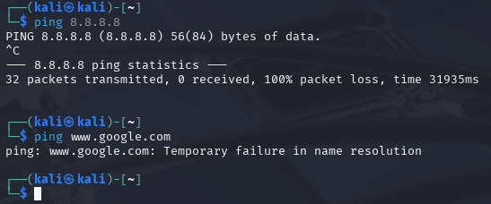
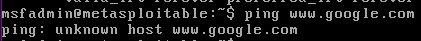
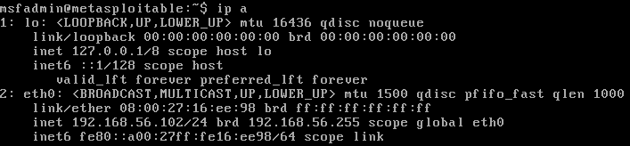
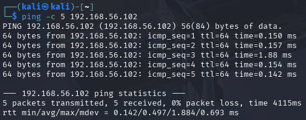
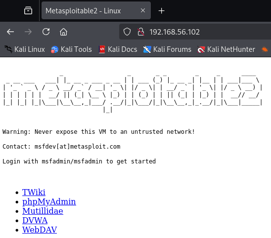
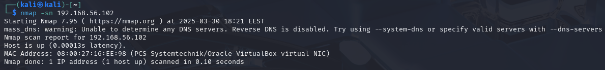
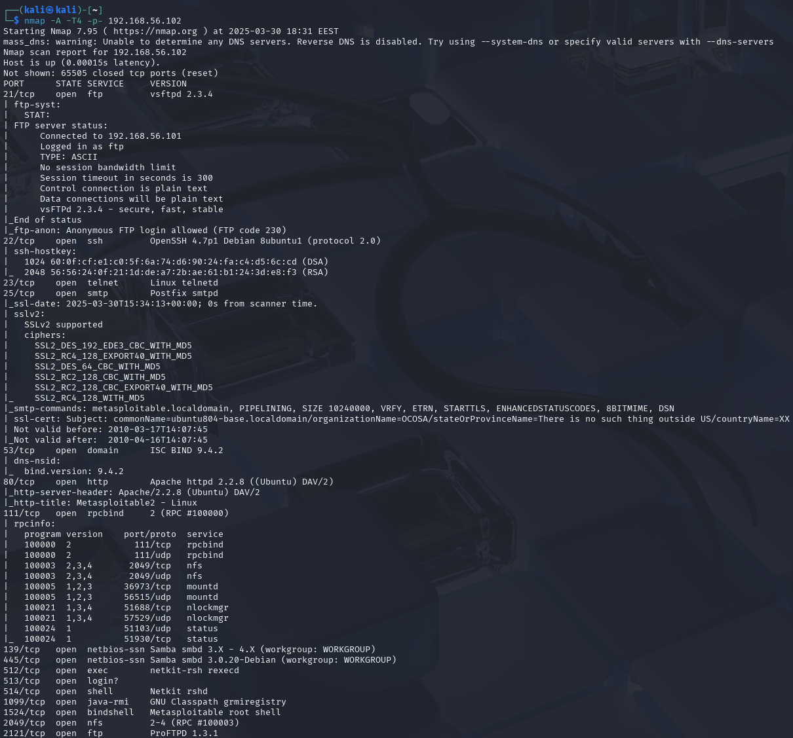
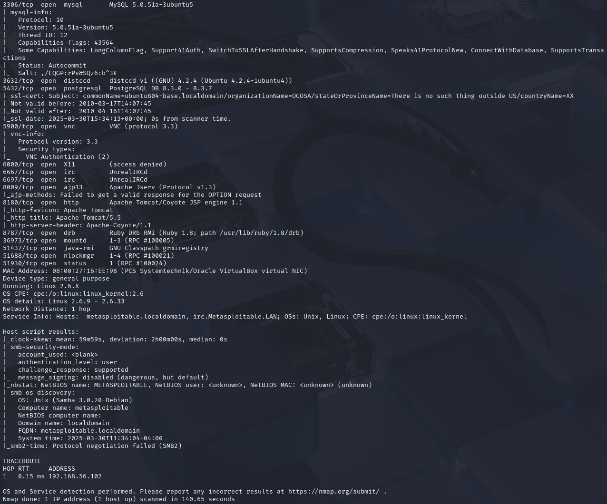

# h1 Kybertappoketju

## Rauta & HostOS

- Asus X570 ROG Crosshair VIII Dark Hero AM4
- AMD Ryzen 5800X3D
- G.Skill DDR4 2x16gb 3200MHz CL16
- 2x SK hynix Platinum P41 2TB PCIe NVMe Gen4
- Sapphire Radeon RX 7900 XT NITRO+ Vapor-X
- Windows 11 Home 24H2

## x) Lue/katso/kuuntele ja tiivistä

### PODCAST?

### Hutchins et al 2011: Intelligence-Driven Computer Network Defense Informed by Analysis of Adversary Campaigns and Intrusion Kill Chains, chapters Abstract, 3.2 Intrusion Kill Chain.

### 4.3 Surveying Essential Tools for Active Reconnaissance
- Videossa keskustellaan porttiskannauksesta ja siihen liittyvistä työkaluista
- **Nmap** on vakain ja monipuolisin porttiskanneri, myös suosituin.
- **Masscan** on puolestaan nopein porttiskanneri
- **Udpprotoscanner** on nopea UDP porttien skannaaja
- Videolla näytetään ja kerrotaan runsaasti kaikkien kolmen mainitun skannerin käytön komentoja ja esimerkkejä siitä miten ne toimii
- Videon lopussa käydään läpi EyeWitness työkalun käyttöä, joka auttaa priorisoimaan skannattuja web sivuja.

(Jon Sternstein 2019)

### KKO 2003:36

## a) Asenna Kali virtuaalikoneeseen
Kali Linux tarjoaa suoran VirtualBox asennuksen kuvakkeena, joten valitsin valmiin Pre-built VM vaihtoehdon asennukseksi. Tuorein viimeisin versio 2025.1. Asennuksessa ei mitään ongelmia.

## b) Irrota Kali-virtuaalikone verkosta
Alkuun oli tarpeen selvitellä, että virtuaalikone on lähtökohtaisesti verkossa. Samalla tarkistelin, mikä mahtaa olla käytössä olevan verkkokortin nimi.

Itse käytin verkosta irroittamiseen suoraa terminaalin komentoa, joka poistaa verkkokortin käytöstä. Toki vaihtoehtoisesti sen voi ja myöhemmin teinkin sen suoraan VirtualBoxin asetuksista poistamalla virtuaalinen kaapeli, mikä taitaa olla loppupeleissä parempi vaihtoehto. Testinä vielä pinganus osoitteeseen 8.8.8.8, jotta nähdään irroittautumisen toimineen.

Luonnollisesti, kun nostetaan terminaalista yhteys takaisin tai yhdistetään virtuaalinen kaapeli saadaan jälleen verkkoyhteys toimimaan.

## c) Porttiskannaa 1000 tavallisinta tcp-porttia omasta koneestasi
Tavoitteena oli skannata oman verkon TCP-portteja. Analysoidaan hieman tarkemmin, mitä syötetty **nmap -T4 -A localhost** tekee.

- **nmap**: nmap valintakomento / ohjelman nimi, että saadaan edes ohjelma käyttöön.
- **-T4**: -T0-5 valinnalla saadaan määritettyä kuinka porttiskannaus ajoitetaan. -T0 ollen hitain vaihtoehto ja -T5 nopein. Tässä skannauksessa käytetty -T4 vaihtoehto on manuaalin mukaan luokkaa "Aggressive scan".
- **-A**: on version detection valinta. Lisäämällä -A syötteeseen, porttiskannaus toimittaa esimerkiksi OS detection, version detection, script scanning ja traceroute lisäykset skannaukseen.
- **localhost**: Toimittaa kohteen virkaa. Tähän voisi vaihtaa minkä tahansa IP osoitteen mitä skannataan, mutta koska kohteena on oma tietokone voidaan käyttää luonnollisesti myös localhost vaihtoehtoa.

Kyseessä on kokonaisuudessaan melko tyypillinen npam porttiskannaus.

Tuloksista voidaan tässä tapauksessa päätellä esimerkiksi seuraavia:

- **Starting Nmap 7.95**: Nmap käynnistyy ja lisäksi kerrottu versionumero sekä ajankohta
- **Host is up**: Vahvistus siitä, että kohde on tavoitettavissa
- **Other addresses for localhost**: Muita kuin localhostin osoitetta ei skannattu
- **All 1000 scanned ports on localhost**: Tässä tapauksessa localhostin kaikki skannatut portit ovat suljettuna, joten mitään tuloksia ei löytynyt.
- **Not shown**: 1000 suljettua tcp porttia ei näytetty
- **Too many fingerprints**: Nmap ei pysty löytämään tarkempia tietoja käyttöjärjestelmästä
- **Network Distances**: 0 hops, koska tapauskessa skannataan omaa verkkoa.
- **OS and Service detection performed**: Tämä on vain muistutus siitä, että OS and Service detection suoritettiin.
- **Nmap done**: Lpuksi vielä raportti siitä, kuinka monta IP-osoitetta skannattiin ja kuinka kauan skannauksessa kesti. Tässä tapauksessa yksi osoite ja 1.90 sekunttia.

## d) Asenna kaksi vapaavalintaista demonia ja skannaa uudelleen
Asensin vapaavalintaisina demoneina apache2 ja openssh, mutta ne olikin jo valmiiksi myös asennettu Kalin pakettiin.

Piti hieman muistella ja lueskella miten Apache2 sai käyntiin, mutta pikaisella googletuksella ja sitä kautta oikeilla komennoilla sain apache2.servicen nostettua ylös. 

Sama homma ssh kanssa, mutta googletuksella homma rokkaamaan.

Nyt kun molemmat demonit saatiin käyntiin, ajoin edellisen tehtävän saman komennon porttiskannausta varten localhostille. Tällä kertaa hieman kattavimmilla tuloksilla. Viime kerrasta poiketen analysoiden tuloksia löydetään seuraavia eroja:

- **22/tcp open**: Portista 22 löytyy käynnistelty OpenSSH ja siihen liittyvät ssh-hostkeyt.
- **80/tcp open**: Portista 80 löytyy puolestaan käynnistelty Apache2 ja siihen liittyvät http-server/title postaukset
- **Running / OS**: Tällä kertaa aikaisemmasta poiketen OS and Service detection on tehnyt työtä käskettyä ja tunnistanut käyttöjärjestelmäksi Linuxin, samalla ilmoittaen myös esimerkiksi Kernel version.
- **Nmap done**: Skannauksen kesto muuttunut oleellisesti ja tällä kertaa meni 8.17 sekunttia.

## e) Asenna Metasploitable 2 virtuaalikoneeseen & f) Tee koneiden välille virtuaaliverkko
Metasploitable 2 asennus ei varsinaisesti vaatinut mitään ihmeellistä. Sourceforgesta löytyi suora latauslinkki valmiille virtuaalikoneelle mikä syötettiin VirtualBoxiin. Kävin antamassa hieman lisää muistia sekä käytössä olevia prosessoreita.

Lisäksi asetin verkkokortin toimimaan ainoastaan Host-only Adapterina, jotta saadaan pelkkä keskenäinen kommunikointi Kali Linuxin kanssa käyttöön. Kali Linuxin puolella kävin tekemässä Adapter 2 kortiksi myös Host-only Adapterin samaa käyttötarkoitusta varten.

Käynnistelin Metasplitablen käyntiin ja kirjauduin sisään ongelmitta.

Poistin Kali Linuxini verkosta, ottamalla liitetyn kuvitteellisen kaapelin pois VirtualBoxista.

Testasin vielä, että Kali poistui varmasti verkosta. Pingasin sekä 8.8.8.8, että www.google.com varmistaakseni.

Varmistelin vielä samalla, että onhan Metasploitable myös pelkässä host-only verkossa pingaamalla www.google.com. 

Selvittelin Metasploitablen IP-osoitteen, jotta pystyn testaamaan yhteyttä Kali Linuxin ja Metasploitablen välillä. **ip a** komennolla saatiin tarpeellinen tieto näkyviin.

Seuraavaksi testiksi pingasin Metasplitablea Kali Linuxin puolelta, jotta näin toimiiko virtuaalikoneiden välinen host-only yhteys.

Toimihan se ongelmitta.

## g) Etsi Metasploitable porttiskannaamalla
Tarkistelin alkuun, että olin aikasemmin valinnut oikean Metasploitablen IP:n tarkistamalla, että etusivulle aukeaa selaimessa Metasploitablen sivu.

Seuraavaksi skannasin komennolla **nmap -sn 192.168.56.102** Metasploitablen. Analysoidaan hieman tarkemmin, mitä kyseinen komento tekee ja mitä tulokset kertovat.

- **nmap**: nmap valintakomento / ohjelman nimi, että saadaan edes ohjelma käyttöön.
- **-sn**: -sn komento poistaa käytöstä porttiskannauksen, eli kyseinen komento selvittää vain sitä onko kohdeosoitteessa oleva laite tavoitettavassa tilassa
- **192.168.56.102**: Toimittaa kohteen virkaa. Tässä tapauksessa Metasploitable virtuaalikoneeni.

Tuloksista voidaankin analysoida seuraavia asioita:

- **Starting Nmap 7.95**: Nmap käynnistyy ja lisäksi kerrottu versionumero sekä ajankohta
- **mass_dns**: nmap ei saanut yhteyttä DNS serveriin ja Reverse DNS on disabloituna.
- **Host is up**: Vahvistus siitä, että kohde on tavoitettavissa
- **MAC Address**: Selvitys kohteen MAC-osoitteesta
- **Nmap done**: Lopuksi vielä raportti siitä, kuinka monta IP-osoitetta (ja kuinka monta kohdetta on tavoitettavissa) skannattiin ja kuinka kauan skannauksessa kesti. Tässä tapauksessa yksi osoite, yksi hosti ja aikaa kului 0.10 sekunttia.

## h) Porttiskannaa Metasploitable huolellisesti ja kaikki portit
Porttiskannaus toteutettiin tällä kertaa jo lähes tutulla kaavalla, mutta loppuun tuli vielä yksi lisäys. Analysoidaan kuitenkin vielä syötetty komento **nmap -A -T4 -p-**

- **nmap**: nmap valintakomento / ohjelman nimi, että saadaan edes ohjelma käyttöön.
- **-A**: on version detection valinta. Lisäämällä -A syötteeseen, porttiskannaus toimittaa esimerkiksi OS detection, version detection, script scanning ja traceroute lisäykset skannaukseen.
- **-T4**: -T0-5 valinnalla saadaan määritettyä kuinka porttiskannaus ajoitetaan. -T0 ollen hitain vaihtoehto ja -T5 nopein. Tässä skannauksessa käytetty -T4 vaihtoehto on manuaalin mukaan luokkaa "Aggressive scan".
- **-p-**: Tällä kertaa ajettu uusi komento. -p- syötteellä porttiskannaus käy läpi kaikki portit 1-65535 välillä. 
- **localhost**: Toimittaa kohteen virkaa. Tähän voisi vaihtaa minkä tahansa IP osoitteen mitä skannataan, mutta koska kohteena on oma tietokone voidaan käyttää luonnollisesti myös localhost vaihtoehtoa.

Tuloksena saadaan melko pitkä kattaus tuloksia, sillä todella monessa portissa on jotain toimintaa. Tarkoituksena oli valita muutama hyökkääjälle mielenkiintoinen portti ja itselle valikoitui heti ainakin yksi selvä valinta, kun silmään osui telnet. Lisäksi valitsin toiseksi portiksi MySQL. Analysoidaan hieman tarkemmin, miksi juuri nämä:

### 23/tcp open - telnet
Itselle pisti portissa 23 oleva telnet heti silmään. Edeltäviltä Tietoturvana liittyviltä kursseilta oli jäänyt mieleen, että telnet ei salaa mitään liikennettä, joten tietoturvan taso on huonolla tasolla ja varmasti mielenkiintoinen kohde hyökkääjälle.

### 3306/tcp open - mysql
Portista 3306 löytyvä MySQL kiinnosti itseä. Muistelin aikaisempien kurssien MySQL heikkouksia ja ajattelin tämän olevan aika yleispätevä hyökkäyksen kohde. Skannauksesta pystytään analysoimaan esimerkiksi Versionumero 5.0.51a-3ubuntu5, joka on jo melko vanhaksi mennyt versio, joten siinä saattaa olla tietoturvariskejä.

Monista muista porteista löytyisi varmasti huomautettavaa ja hyökkääjälle mielenkiintoista asiaa, mutta nämä pisti itselle omilla tiedoilla silmään.

## Työaika
Tehtävien tekemiseen mennyt aika 30.3.2025 kello 16:30 - 19:15

Raportin kirjoitusaika 31.3.2025 kello 09:15 - 15:10 (Katkonaisesti muiden töiden välissä)

Aktiivista työskentelyä yhteensä noin 5 tuntia 30 minuuttia.

## Lähteet
https://terokarvinen.com/tunkeutumistestaus/

https://lockheedmartin.com/content/dam/lockheed-martin/rms/documents/cyber/LM-White-Paper-Intel-Driven-Defense.pdf

Jon Sternstein 2019 https://learning.oreilly.com/videos/the-art-of/9780135767849/9780135767849-SPTT_04_00/

https://finlex.fi/fi/oikeuskaytanto/korkein-oikeus/ennakkopaatokset/2003/36

https://linux.die.net/man/1/nmap

https://cdn.comparitech.com/wp-content/uploads/2019/06/Nmap-Cheat-Sheet.pdf

https://r3kind1e.github.io/2022/06/08/Nmap-OS-Fingerprinting/

https://www.cyberciti.biz/faq/star-stop-restart-apache2-webserver/

https://forums.ubports.com/topic/8631/howto-autostart-ssh/2

https://tuomasvalkamo.com/PenTestCourse/week-2/

https://www.kali.org/get-kali/#kali-virtual-machines

https://sourceforge.net/projects/metasploitable/

https://docs.rapid7.com/metasploit/metasploitable-2

https://web.synametrics.com/risks-running-telnet.htm

https://www.invicti.com/web-vulnerability-scanner/vulnerabilities/out-of-date-version-mysql/

