# h2 Täysin Laillinen Sertifikaatti

## Rauta & HostOS

- Asus X570 ROG Crosshair VIII Dark Hero AM4
- AMD Ryzen 5800X3D
- G.Skill DDR4 2x16gb 3200MHz CL16
- 2x SK hynix Platinum P41 2TB PCIe NVMe Gen4
- Sapphire Radeon RX 7900 XT NITRO+ Vapor-X
- Windows 11 Home 24H2

**Tehtävän aloitusaika 5.4.2025 kello 10:00**

## x) Lue/katso/kuuntele ja tiivistä

### OWASP 2021: OWASP Top 10:2021

#### A01:2021 – Broken Access Control
- Broken Access Control on käyttöoikeuksien rikkomista, eli pääsyä paikkaan tai toimintoihin mihin ei pitäisi olla oikeuksia
- Tämmöisiä voi tapahtua esimerkiksi ohjelmiston tai sivuston puutteellisissa käyttöoikeuden tarkastuksissa
- Johtaa helpoisti tietovuotoihin, tietojen ja järjestelmän muokkaamiseen / pääsyyn.

(OWASP 2021)
#### A10:2021 – Server-Side Request Forgery (SSRF)
- Hyökkäyksessä päästään lähettämään palvelimelle pyyntöjä joihin ei pitäisi päästä
- Tapahtuu, koska palvelin ei tarkista käyttäjän antamia osoitetietoja
- Seurauksena saattaa olla pääsy järjestelmään ja tietovuotoja

(OWASP 2021)
### PortSwigget Academy:

#### Insecure direct object references (IDOR)
- IDOR hyökkäyksissä päästään käsiksi objekteihin suoraan käyttäjän syötteellä
- Kyseessä on pääsynvalvonnan toteutusvirheestä johtuva tapa kiertää pääsynvalvontaa

(PortSwigger 2025)
#### Path traversal
- Path traversal tapahtuu esimerkiksi syöttämällä tiedostonnimeksi joku polku, missä siirrytään muihin kansioihin ja päästään käsiksi juurihakemiston tiedostoihin.
- Hyökkääjä pääsee näin ollen lukemaan tiedostoja ja kansioita palvelimelta, missä on arkaluontoista tietoa

(PortSwigger 2025)
#### Server-side request forgery (SSRF)
- Tyypillisessä SSRF-hyökkäyksessä hyökkääjä saa palvelimen muodostamaan yhteyden sisäisiin palveluihin organisaation infrasa
- Joissakin tapauksissa myös pystyy pakottamaan palvelimen muodostamaan yhteyden ulkoisiin järjestelmiin

(PortSwigger 2025)
#### Cross-site scripting
- XSS on tietoturvahaavoittuvuus, missä hyökkääjä pääsee vaarantamaan käyttäjien toiminnot sovelluksen / sivun kanssa.
- Hyökkääjä pystyy naamioitumaan olevansa käyttäjä ja suorittaa mitä tahansa käyttäjän toimintoja millä päästään käsiksi tietoihin
- Yleisesti ottaen hyökkääjä käyttää hyväkseen verkkosivuston kyvyttömyyttä erottaa luotettava ja epäluotettava sisältö toisistaan

(PortSwigger 2025)
## a) Totally Legit Sertificate.
ZAProxy asentaminen tapahtui komennolla

        sudo apt-get install zaproxy

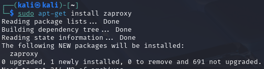

Käynnistys terminaalissa **zaproxy** komennolla ja avatessa päivittelin kaikki Add-onsit, kerta ohjelma sitä itse ehdotteli.

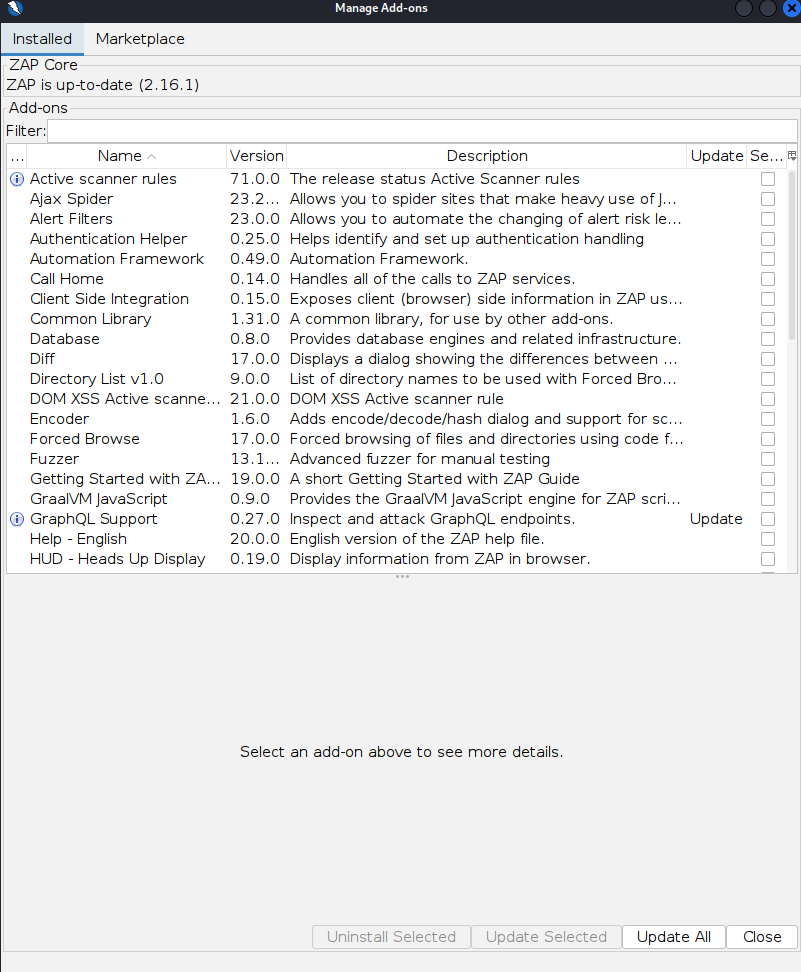

ZAP asettaminen Firefoxin proxyksi vaati tietenkin CA-sertifikaatin hakemista. Tämä löytyi **Tools -> Options -> Network -> Server Certificates**. Napsauttelin vielä uuden sertifikaatin generointia ennen sen syöttämistä Firefoxille.

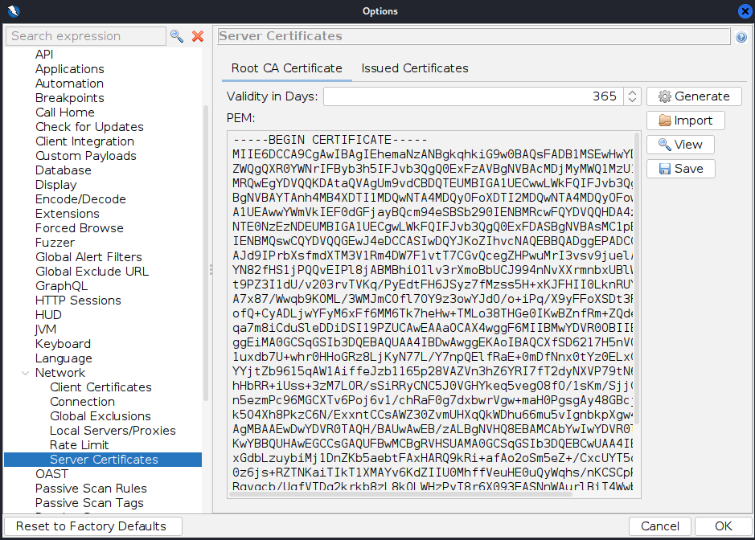

Firefoxin puolelta löytyy **Settings** välilehdeltä **Certificates** kohta hyödyntämällä hakutoimintoa.

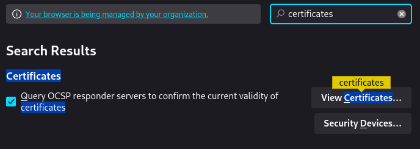

Import nappulalla päästään syöttämään ZAP haettu sertifikaatti, Teron oppitunneilta muistelin **"Trust this CA to identify websites."** tarpeellisuuden, mutta käy myös logiikalla ajatellen järkeen verraten mitä ollaan seuraavaksi tehtävissä tekemässä.

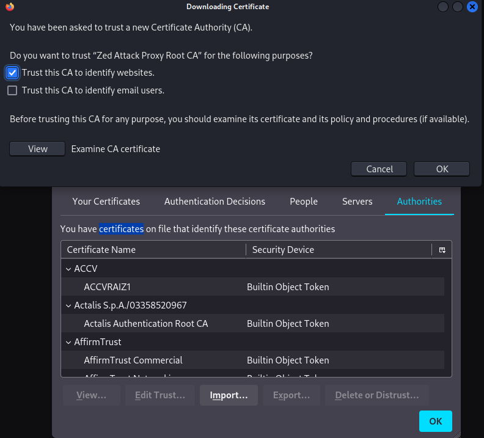

Seuraavaksi Firefoxin **Network Settings** välilehdelle tekemään tarvittavat Proxy muutokset.

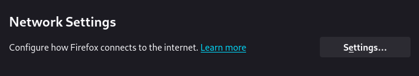
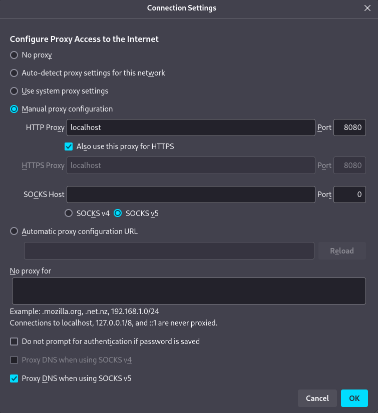

Tehtävänannossa oli myös tavoitteena saada ZAP sieppaamaan kuvat. ZAP asetuksista **Tools -> Options -> Display** löytyy kohta **Process images in HTTP requests/responses** raksi ruutuun ja homma rokkaa.

Proxy testaukseen Metaspoitablen weppipalvelun kanssa ja hyvinhän se lähti rokkaamaan.

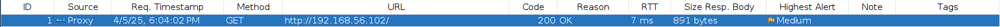

## b) Kettumaista
FoxyProxy asentamista varten suunnattiin Firefoxin Add-ons valikoimaan.

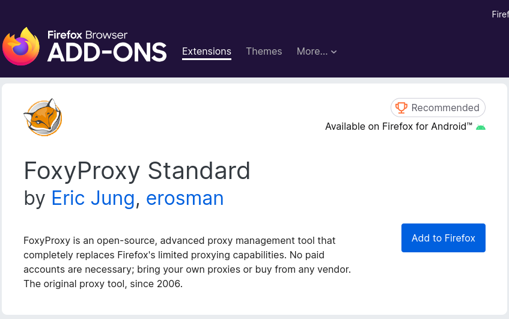

Asentamisen jälkeen laajennus käyntiin ja laajemmin auki kohdasta **Options**.

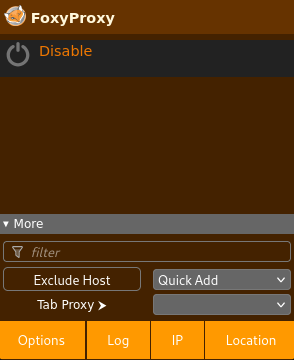

ZAP profiilin luontia varten **Proxies** välilehdeltä luodaan tarpeellinen profiili.

Alemmassa valikossa Patternit pystyi lisäämään myös, pelkkää Pattern käyttöä varten. Lisäilin Localhostin jo valmiiksi, PortSwigger tehtäviä varten en ollut vielä varma mitä lisäillä.

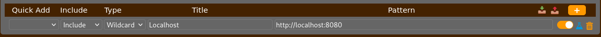

**Tauko tehtävien tekemisestä alkaen 5.4.2025 kello 11:30**

## c) Reflected XSS into HTML context with nothing encoded
**Tehtävien tekeminen jatkuu 5.4.2025 kello 17:30**

## d) Stored XSS into HTML context with nothing encoded

## e) File path traversal, simple case

## f) File path traversal, traversal sequences blocked with absolute path bypass

## g) File path traversal, traversal sequences stripped non-recursively

**Tauko tehtävien tekemisestä alkaen 5.4.2025 kello 20:15**

## h) Insecure direct object references
**Tehtävien tekeminen jatkuu 6.4.2025 kello 11:30**

## i) Basic SSRF against the local server

**Tehtävän lopetusaika 6.4.2025 kello XXXX. Aktiivista työskentelyä yhteensä noin X tuntia XX minuuttia.**

## Lähteet
Karvinen T 2025. h2 Täysin Laillinen Sertifikaatti. Tero Karvisen verkkosivut. Luettavissa: https://terokarvinen.com/tunkeutumistestaus/ Luettu 5.4.2025

OWASP 2021. A01:2021 – Broken Access Control. Luettavissa: https://owasp.org/Top10/A01_2021-Broken_Access_Control/ Luettu 5.4.2025

OWASP 2021. A10:2021 – Server-Side Request Forgery (SSRF). Luettavissa: https://owasp.org/Top10/A10_2021-Server-Side_Request_Forgery_%28SSRF%29/ Luettu 5.4.2025

PortSwigger 2025. Insecure direct object references (IDOR). Luettavissa: https://portswigger.net/web-security/access-control/idor Luettu 5.4.2025

PortSwigger 2025. Server-side request forgery (SSRF). Luettavissa: https://portswigger.net/web-security/ssrf Luettu 5.4.2025

PortSwigger 2025. Cross-site scripting. Luettavissa: https://portswigger.net/web-security/cross-site-scripting Luettu 5.4.2025

