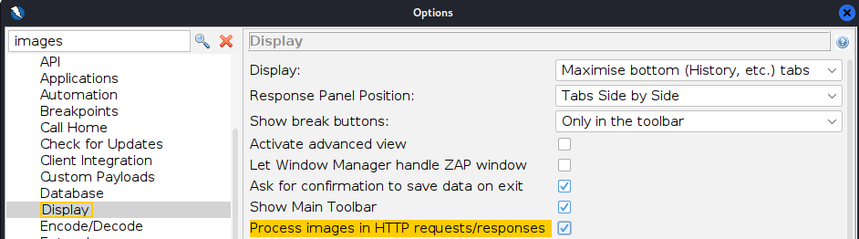
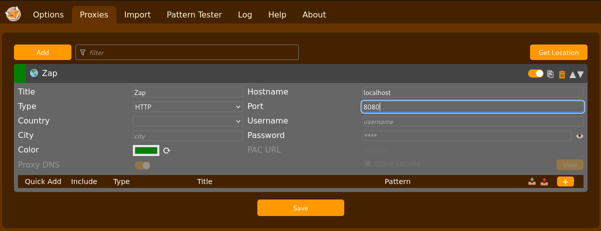

# h2 Täysin Laillinen Sertifikaatti

## Rauta & HostOS

- Asus X570 ROG Crosshair VIII Dark Hero AM4
- AMD Ryzen 5800X3D
- G.Skill DDR4 2x16gb 3200MHz CL16
- 2x SK hynix Platinum P41 2TB PCIe NVMe Gen4
- Sapphire Radeon RX 7900 XT NITRO+ Vapor-X
- Windows 11 Home 24H2

**Tehtävän aloitusaika 5.4.2025 kello 10:00**

## x) Lue/katso/kuuntele ja tiivistä

### OWASP 2021: OWASP Top 10:2021

#### A01:2021 – Broken Access Control
- Broken Access Control on käyttöoikeuksien rikkomista, eli pääsyä paikkaan tai toimintoihin mihin ei pitäisi olla oikeuksia
- Tämmöisiä voi tapahtua esimerkiksi ohjelmiston tai sivuston puutteellisissa käyttöoikeuden tarkastuksissa
- Johtaa helpoisti tietovuotoihin, tietojen ja järjestelmän muokkaamiseen / pääsyyn.

(OWASP 2021)
#### A10:2021 – Server-Side Request Forgery (SSRF)
- Hyökkäyksessä päästään lähettämään palvelimelle pyyntöjä joihin ei pitäisi päästä
- Tapahtuu, koska palvelin ei tarkista käyttäjän antamia osoitetietoja
- Seurauksena saattaa olla pääsy järjestelmään ja tietovuotoja

(OWASP 2021)
### PortSwigget Academy:

#### Insecure direct object references (IDOR)
- IDOR hyökkäyksissä päästään käsiksi objekteihin suoraan käyttäjän syötteellä
- Kyseessä on pääsynvalvonnan toteutusvirheestä johtuva tapa kiertää pääsynvalvontaa

(PortSwigger 2025)
#### Path traversal
- Path traversal tapahtuu esimerkiksi syöttämällä tiedostonnimeksi joku polku, missä siirrytään muihin kansioihin ja päästään käsiksi juurihakemiston tiedostoihin.
- Hyökkääjä pääsee näin ollen lukemaan tiedostoja ja kansioita palvelimelta, missä on arkaluontoista tietoa

(PortSwigger 2025)
#### Server-side request forgery (SSRF)
- Tyypillisessä SSRF-hyökkäyksessä hyökkääjä saa palvelimen muodostamaan yhteyden sisäisiin palveluihin organisaation infrasa
- Joissakin tapauksissa myös pystyy pakottamaan palvelimen muodostamaan yhteyden ulkoisiin järjestelmiin

(PortSwigger 2025)
#### Cross-site scripting
- XSS on tietoturvahaavoittuvuus, missä hyökkääjä pääsee vaarantamaan käyttäjien toiminnot sovelluksen / sivun kanssa.
- Hyökkääjä pystyy naamioitumaan olevansa käyttäjä ja suorittaa mitä tahansa käyttäjän toimintoja millä päästään käsiksi tietoihin
- Yleisesti ottaen hyökkääjä käyttää hyväkseen verkkosivuston kyvyttömyyttä erottaa luotettava ja epäluotettava sisältö toisistaan

(PortSwigger 2025)
## a) Totally Legit Sertificate.
ZAProxy asentaminen tapahtui komennolla

        sudo apt-get install zaproxy

Käynnistys terminaalissa **zaproxy** komennolla ja avatessa päivittelin kaikki Add-onsit, kerta ohjelma sitä itse ehdotteli.

ZAP asettaminen Firefoxin proxyksi vaati tietenkin CA-sertifikaatin hakemista. Tämä löytyi **Tools -> Options -> Network -> Server Certificates**. Napsauttelin vielä uuden sertifikaatin generointia ennen sen syöttämistä Firefoxille.

Firefoxin puolelta löytyy **Settings** välilehdeltä **Certificates** kohta hyödyntämällä hakutoimintoa.

Import nappulalla päästään syöttämään ZAP haettu sertifikaatti, Teron oppitunneilta muistelin **"Trust this CA to identify websites."** tarpeellisuuden, mutta käy myös logiikalla ajatellen järkeen verraten mitä ollaan seuraavaksi tehtävissä tekemässä.

Seuraavaksi Firefoxin **Network Settings** välilehdelle tekemään tarvittavat Proxy muutokset.

Tehtävänannossa oli myös tavoitteena saada ZAP sieppaamaan kuvat. ZAP asetuksista **Tools -> Options -> Display** löytyy kohta **Process images in HTTP requests/responses** raksi ruutuun ja homma rokkaa.

Proxy testaukseen Metaspoitablen weppipalvelun kanssa ja hyvinhän se lähti rokkaamaan.

## b) Kettumaista
FoxyProxy asentamista varten suunnattiin Firefoxin Add-ons valikoimaan.

Asentamisen jälkeen laajennus käyntiin ja laajemmin auki kohdasta **Options**.

ZAP profiilin luontia varten **Proxies** välilehdeltä luodaan tarpeellinen profiili.

Alemmassa valikossa Patternit pystyi lisäämään myös, pelkkää Pattern käyttöä varten. Lisäilin Localhostin jo valmiiksi, PortSwigger tehtäviä varten en ollut vielä varma mitä lisäillä.

**Tauko tehtävien tekemisestä alkaen 5.4.2025 kello 11:30**

## c) Reflected XSS into HTML context with nothing encoded
**Tehtävien tekeminen jatkuu 5.4.2025 kello 17:30**

Tehtävänannossahan oli tiedossa, että cross-sit scripting haavoittuvuus löytyy HTML muodossa hakutoiminnosta ja tavoitteena oli saada sivusto pyytämään funtkiota **alert**. Itse aloitin syöttämällä pelkän **alert** hakukentään ja tarkastelemalla tuloksia.

Sivuston lähdekoodia tarkastelemalla nähdään, että syöte on suoraan h1/h1 muodossa sivustolla.

Näin ollen, kun hakukentässä suoritetaan suoraan alert-funktiota käyttävä JavaScript-koodi, saadaan tehtävä suoritettu onnistuneesti.

- <Script> tagit toimittaa tässä tapauksessa tapaa kertoa HTML käyttävälle selaimella, että niiden sisällä on suoritettava JavaScript
- alert(1) funtkio on JavaScript-koodi, joka luo ponnahdusikkunan selaimeen ja tulosteena 1.

Ja kun tarkastellaan tarkemmin uutta osoiteriviä, nähdään sielä suoritettu skripti myös.

Tehtävä tämän myötä suoritettu.

(PortSwigger 2025)
## d) Stored XSS into HTML context with nothing encoded
Tehtävänannon perusteella oli tiedossa, että tavoitteena oli tällä kertaa löytää vastaava haavoittuuvuus kuin c) tehtävässä, mutta tällä kertaa blog postin kommenttikentästä. Tehtävä auki ja valitsin näistä vain ensimmäisen blogi postauksen.

Testasin ensin kommenttikenttää ja tarkistelin lähdekoodia millaisessa muodossa syöte ilmenee.

Ja kuten testistä nähdään, viesti löytyy suoraan p/p viitteen sisältä. Mitä jos syötetäänkin HTML koodia kommenttikenttään ja annetaan oma viestimme otsikointimuodosa h1/h1? 

Viestihän näyttää tulevan otsikkona perille!

Tavoitteena oli siis saada jälleen kutsumaan alert funktiota, kun blogipostia katsellaan joten annetaan edellisen tehtävän JavaScipt-koodi kommenttina.

Ja nyt kun tarkastellaan blogin sivustoa, saadaan palautteena suoritettu skripti ja tehtävä onnistuneesti suoritettuna.

(PortSwigger 2025)
## e) File path traversal, simple case
ZAP päälle ja tehtävä auki. Tehtävänannossa on annettu selvät ohjeet löytää File path traversal tavalla /etc/passwd. Etusivulta löytyy valikoima erilaisia tuotteita, joten alkuun yksi niistä auki ja katsotaan tarkemmin mitä ZAP tuottaa.

GET:eistä pistää itselle silmään **GET:image(filename)** etenkin sen takia, että siinä on juuri tuo filename. Portswiggerin "What is path traversal" esimerkit sisälsi nimenomaan hyökkäyksiä missä hyökkääjä hyödyntää filename parametriä.

ZAP:issa komento **CTRL+W** avaa suoraan Requesterin, missä voidaan tarkastella tarkemmin GET requestia. Ja sieltähän pistää silmään tietenkin tässä tapauksessa 8.jpg kuvan **filename=8.jpg**

Mitä jos vaihdetaan kuvan tilalle kutsu tarkastella /etc/passwd sisältöä? Lisäämällä filename= perään ../../../etc/passwd ja lähettämällä Request. Responsessa pitäisi näkyä mahdollisesti jotain, sillä Unix pohjaisissa järjestelmissä tämä polku sisältää tyypillisesti palvelimelle rekisteröidyt käyttäjät.

Responsessa HTTP/1.1 400 Bad Request ja "Missing parameter 'filename'" aiheutti kyllä hetken harmaita hiuksia. Tarkemmalla vilkaisulla muokattuun filename syötteeseen huomasin, että olin vahingossa poistanut = merkin filename perästä. Uusi yritys perään muokatulla rivillä.

Tällä kertaa HTTP/1.1 200 OK, joten homma meni ainakin läpi. Nyt ku ei tarkastella enään kuvaa, voidaan vaihtaa Body: Image alta Text tilalle niin nähdään Response tarkemmin.

Responsessahan näkyy selvästi /etc/passwd sisältöä, eli palvelimelle rekisteröityjä käyttäjiä ja kun palaillaan takaisin Firefoxiin tarkastelemaan niin harjoitus näyttää olevan suoritettu.

(PortSwigger 2025)
## f) File path traversal, traversal sequences blocked with absolute path bypass
Ideahan tässä tehtävänannossa on sama, saada esiin /etc/passwd tiedosto. Ainoa ero on se, että tällä kertaa sivusto on konfiguroitu niin ettei ../ sekvenssejä pystytä käyttämään eli kuten tehtävän nimi antaa jo ymmärtää. Tehtäväsivuston ensinäkymä on samanlainen, joten availlaan ensimmäinen sivuston valinnoista ja tarkastellaan tarkemmin ZAProxyssä.

GET:image(filename) jälleen auki **CTRL+W** komennolla ja tällä kertaa nähdäänkin samanlainen polku, mutta kuvalla 16.jpg.

Testasin kuitenkin, mitä tapahtuu jos syötän edellisen tehtäävän vastaavan ../../../etc/passwd ja lähetän pyynnön. Vastauksena saatiin kuitenkin "No such file", eli toiminto on blokattu, kuten ohjeistuksesta olikin tiedossa.

PortSwiggerin sivuilla onkin puhetta siitä, että joissakin tapauksissa on mahdollista käyttään "absoluuttista polkua", joten jätin syötteestä vain alun ../../../ pois ja laitoin pelkän **filename=/etc/passwd**

Ja näin. Reseponsesta löydetään jälleen vastaavat käyttäjätiedot passwd tiedoston syötteestä.

(PortSwigger 2025)
## g) File path traversal, traversal sequences stripped non-recursively
Tavoite on jälleen sama, päästä tarkastelemaan /etc/passwd tiedoston tietoja. Tällä kertaa kuitenkin suojausta sivustolla muutettu niin, että se poistaa tiedostonnimestä polkuja läpikäyvät sekvenssit ja edellinen absoluuttinen polku on suojattu, eli jos syötetään esimerkiksi ../../../etc/passwd jäljelle ei jää mitään mihin siirtyä. Sivustolle mennessä jälleen valinnanvaraa, mutta tarkistellaan ensimmäistä ZAProxyssä tarkemmin.

Kuten mainitsin, ratkaisu ei voi olla absoluuttinen polku eikä tyypillinen polkuja läpikäyvä sekvenssi ../../../, vaan ratkaisu tulee olla jotain muuta. PortSwigger tarjoilee jälleen lapaan tavan, missä hyödynnetään sisäkkäisiä läpikulkusekvenssejä eli käytännössä lisätään syöte tuplana ja suojaus poistaa niistä vain sisemmät sekvenssit. Syötin filename perään **=....//....//....//etc/passwd** ja testasin lähettää Requestin. 

Ja kuten nähdään, Reponsena saadaan jälleen /etc/passwd sisältö. Tässä tapauksessa kun syötettiin tuplana läpikulkusekvenssit, poistaa suojaus pyynnöstä vain sisimmäiset joten jäljelle jää vielä vastaava setti sekvenssejä poiston jälkeenkin.

(PortSwigger 2025)
**Tauko tehtävien tekemisestä alkaen 5.4.2025 kello 20:15**

## h) Insecure direct object references
**Tehtävien tekeminen jatkuu 6.4.2025 kello 11:30**

Harjoituksen tavoitteena ja ohjeistuksena on suorittaa tyypillinen IDOR hyökkäys. Tehtävä auki ja tarkastellaan mitä tarjolla.

Valitsin yhden kaupan tuotteista, mutta pisti myös samalla silmään vaihtoehdot "My Account" ja "Live chat". Tarkastelin hieman ZAP kautta tuotesivua, mutta tällä kertaa mitään vastaavaa ratkaisua ei löytynyt ja oikeastaan ainoa GET:product(productid) ei sisältänyt mitään merkittävää.

Siirryin tarkastelemaan **My Account** sivustoa ja syöttelinkin testiksi syötteen ja tarkastelin sitä ZAProxyssä, mutta ei sieltäkään mitään mielenkiintoista varsinaisesti löytynyt.

Hetken aikaan pyörin sivustolla ja olin vähän jumissa, mutta palasin tarkastelemaan varsinaista tehtävänantoa PortSwiggerin sivustolla ja huomasin, että tehtävässä pitää tarkastella **"user chat logs directly on the server's file system**, joten etsinnässä siis syöte mihin pääsee kirjoittamaan. Hyppäsin chattailemaan Live Chattiin, missä vastassa oli Hal Pline chatbotti.

Ei se botti ainakaan suoraa antanut salasanaa pyytämällä, no mutta painetaan **View transcript** ja tarkastellaan tarkemmin ZAP puolella, mitä sisältää.

GET:2.txt on siis selvästi chatbotin kanssa käymäni keskustelu. Tehtävänannossa olikin tavoite löytää tiedot staattisesta URL osoitteesta, joten mitä jos vaihdetaan Requestin 2.txt johonkin toiseen ja lähetään se takaisin?

**"No transcript"** eli 0.txt ei sisällä mitään luettavaa. Kokeillaan seuraavaksi 1.txt.

Bingo. Responsessa nähdään joku tallennettu keskustelu toisen kanssa, missä näyttää olevan myös salasana. Chatti ei varsinaisti kerro, onko keskustelija Carlos, mutta tehtävänannosta tiedämme sen olevan käyttäjätunnus joten testaan kirjautua tiedoilla.

Ja toimiihan se, kirjautuminen onnistunut ja harjoitus suoritettu onnistuneesti.

(PortSwigger 2025)
## i) Basic SSRF against the local server

**Tehtävän lopetusaika 6.4.2025 kello XXXX. Aktiivista työskentelyä yhteensä noin X tuntia XX minuuttia.**

## Lähteet
Karvinen T 2025. h2 Täysin Laillinen Sertifikaatti. Tero Karvisen verkkosivut. Luettavissa: https://terokarvinen.com/tunkeutumistestaus/ Luettu 5.4.2025

OWASP 2021. A01:2021 – Broken Access Control. Luettavissa: https://owasp.org/Top10/A01_2021-Broken_Access_Control/ Luettu 5.4.2025

OWASP 2021. A10:2021 – Server-Side Request Forgery (SSRF). Luettavissa: https://owasp.org/Top10/A10_2021-Server-Side_Request_Forgery_%28SSRF%29/ Luettu 5.4.2025

PortSwigger 2025. Insecure direct object references (IDOR). Luettavissa: https://portswigger.net/web-security/access-control/idor Luettu 5.4.2025

PortSwigger 2025. Server-side request forgery (SSRF). Luettavissa: https://portswigger.net/web-security/ssrf Luettu 5.4.2025

PortSwigger 2025. Cross-site scripting. Luettavissa: https://portswigger.net/web-security/cross-site-scripting Luettu 5.4.2025

PortSwigger 2025. Lab: Reflected XSS into HTML context with nothing encoded. Luettavissa: https://portswigger.net/web-security/cross-site-scripting/reflected/lab-html-context-nothing-encoded Luettu 5.4.2025

PortSwigger 2025. Lab: Stored XSS into HTML context with nothing encoded. Luettavissa: https://portswigger.net/web-security/cross-site-scripting/stored/lab-html-context-nothing-encoded Luettu 5.4.2025

