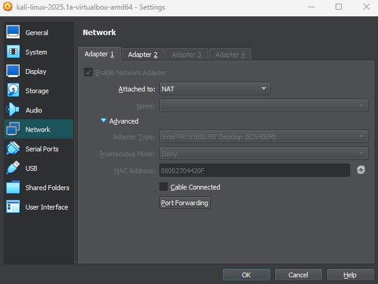

# h3 Fuzzy

## Rauta & HostOS

- Asus X570 ROG Crosshair VIII Dark Hero AM4
- AMD Ryzen 5800X3D
- G.Skill DDR4 2x16gb 3200MHz CL16
- 2x SK hynix Platinum P41 2TB PCIe NVMe Gen4
- Sapphire Radeon RX 7900 XT NITRO+ Vapor-X
- Windows 11 Home 24H2

**Tehtävän aloitusaika 12.4.2025 kello 11:30**

## x) Lue/katso/kuuntele ja tiivistä

### Karvinen 2023: Find Hidden Web Directories - Fuzz URLs with ffuf
- Fuff on Joona "joohoi" Hoikkala kehittämät web fuzzer
- Artikkelissa Fuffataan piilotettuja kansiorakenteita, mutta Fuff avulla voi web fuzzata mitä vain ja löytää web-palvelimilta esimerkiksi GET-, POST-parametrejä, hakemistoja, otsikoita yms.
- Fuff on erittäin nopea ja Fuffia voi testata paikallisesti ilman internet-yhteyttä. Tärkeää onkin muistaa, että penetraatiotestauksen teknkiikoiden käyttö tulee suorittaa lain sekä eettisten perjaatteiden puitteissa.
- Artikkelissa käydään läpi muutama eri harjoitus, miten ffufia voidaan testata lokaalisti ja sen eri komenteja

(Karvinen 2023; Nurminen 2024)
### Hoikkala 2023: ffuf README.md
- GitHub README sisältää kattavasti eri komentoja ffuf käytön tueksi
- Lisäksi löytyy asennusohjeet ja esimerkkejä käytöstä

(Joohoi 2023)
## a) Fuzzzz. Ratkaise dirfuz-1 artikkelista [Karvinen 2023: Find Hidden Web Directories - Fuzz URLs with ffuf.](https://terokarvinen.com/2023/fuzz-urls-find-hidden-directories/)
Tämän olinkin jo toisella kurssilla ratkaissut, mutta muistin virkistämiseksi ratkaisin sen uudestaan. Alkuun oli tietenkin tarpeellista ladata itse **Fuff** ja kävin hakemassa sen suoraan GitHub sivustolta.

        wget https://github.com/ffuf/ffuf/releases/download/v2.1.0/ffuf_2.1.0_linux_amd64.tar.gz

Puretaan ja testataan toimivuus.

        tar -xf ffuf_2.1.0_linux_amd64.tar.gz
        ./ffuf

Tämän jälkeen oli tarpeellista asentaa itse Dirfuzt-1 harjoitusympäristö, mikä löytyi suoraa [Tero Karvisen verkkosivuilta](https://terokarvinen.com/2023/fuzz-urls-find-hidden-directories/) ohjeiden kanssa.

        wget https://terokarvinen.com/2023/fuzz-urls-find-hidden-directories/dirfuzt-1
        chmod u+x dirfuzt-1
        ./dirfuzt-0

Ffuf etsintää varten olin ladannut [SecLists](https://github.com/danielmiessler/SecLists) kirjaston nimeltä [common.txt](https://terokarvinen.com/2023/fuzz-urls-find-hidden-directories/Miessler-etal-2023-SecLists/common.txt) mitä hyödynnetään. Ffuf käyntiin

        ./ffuf -w common.txt -u http://127.0.0.2:8000/FUZZ

Tuloksista nähdään, että lähes kaikissa Status on 200 eli ok ja Size 154 määrittää koon biteissä. Mutta yksi vastauksista okin .git 301/41. Mitä jos filtteröidään kaikki 154 bittiset vastaukset pois näkyvistä lisäämällä -fs 154 syötteen perään?

        ./ffuf -w common.txt -u http://127.0.0.2:8000/FUZZ -fs 154

Bingo. Jäljelle jää esimerkiksi wp-admin ja .git. Selaimeen osoitteen perään kyseiset rakenteet ja löydetään pari lippua.

(Karvinen 2023, 2025; Nurminen 2024)
## b) Fuff me. Asenna FuffMe-harjoitusmaali. [Karvinen 2023: Fuffme - Install Web Fuzzing Target on Debian](https://terokarvinen.com/2023/fuffme-web-fuzzing-target-debian)
Fuffme harjoitusympäristöä varten oli tarpeellista asentaa Docker ja Git, että saadaan homma alkuun. Ohjeesta poiketen, ffuf löytyi jo valmiina joten sitä en asennellut uudestaan.

        sudo apt-get install docker.io git

Haetaan GitHub repositorio ffufme:lle omalle virtuaalikoneelle.

        git clone https://github.com/adamtlangley/ffufme

Ohjelman rakentaminen käyntiin Dockerilla ja perään käynnistys.

        sudo docker build -t ffufme .
        sudo docker run -d -p 80:80 ffufme

Helpommin sanottu kuin tehty! Näytti olevan TCP portti 80 jo käytössä, Apache2 se siellä varmasti kummittelee joten suljetaan se.

        sudo systemctl stop apache2.service
        sudo systemctl status apache2.service

Uusi yritys käynnistelylle ja curlilla tarkistelu, lähtikö homma rokkaamaan.

Hyvin pelittää. Tehtävää varten oli tarpeellista latailla myös wordlistit mitä ffufilla ajetaan.

(Karvinen 2023; ffufme 2021)
## c) - h) Ratkaise ffufme harjoitukset
Tehtäviä varten sammuttelin varmuudeksi oman verkkoyhteyden, ettei fuzzatessa käy mitään vahinkoja.

### c) Basic Content Discovery
Ensimmäinen tehtävä toimi tavallaan testinä, että tyypillinen perus fuzzaus käyttäen ffufia toimii localhostille, missä itse ffufme pyörii. Käyttöön wordlisteistä common.txt ja tavoitteena oli löytää **class** & **development.log**

        ffuf -w ~/wordlists/common.txt -u http://localhost/cd/basic/FUZZ

Löytyyhän ne. Curlataan vielä, niin nähdään mitä tiedostot sisältää.

Lippu tehtävän ratkaisusta.
### d) Content Discovery With Recursion
Seuraavassa tehtävässä lisäiltiin ffuf syötteeseen **-recursion**, mikä kertoo ffufille, että kun se kohtaa kansion tulee sen skannata sisältöä niin kauan kunnes enempää tuloksia ei löydy.

        ffuf -w ~/wordlists/common.txt -recursion -u http://localhost/cd/recursion/FUZZ

common.txt listaa hyödyntäen ffuf löysi kansiorakenteen **/admin** jonka alta löytyi **/users** ja sen sisältä vielä **/96**. Eli kokonaisuudessaan rakenne näyttäisi **http://localhost/cd/recursion/admin/users/96** ja sieltähän me löydetään lippu.

### e) Content Discovery With File Extensions
Tehtävänannossa on tarkoitus fuzzata löytynyttä /logs kansiota, mutta sieltä ei päästä katsomaan tarkemmin sisältöä. Logs kansiossa saattaa kuitenkin olla sisällä .log päätteisiä tiedostoja, joten lisäämällä -e .log ffuf syötteeseen voidaan valita minkä tyyppisiä tiedostoja etsitään.

        ffuf -w ~/wordlists/common.txt -e .log -u http://localhost/cd/ext/logs/FUZZ

users.log sisältää varmaan käyttäjätietoja? Mielenkiintoista, tarkistellaan tarkemmin.

Ei sentään, mutta tehtävän lippu joka tapauksessa.
### f) No 404 Status
Tehtävässä on tarkoitus fuzzata ja tarkastella HTTP status koodeja, joten suoritetaan alkuskannaus.

        ffuf -w ~/wordlists/common.txt -u http://localhost/cd/no404/FUZZ

Vastauksia aika kattava määrä, kuvassa tietenkin vai murto-osa. Size 669 kokoisia vastauksia näyttää olevan aika runsas määrä, mitä jos filteroidaan jälleen -fs komennolla 669 bittiset tulokset pois ja katsotaan mitä jää jäljelle.

        ffuf -w ~/wordlists/common.txt -u http://localhost/cd/no404/FUZZ -fs 669

Mielenkiintoista, salaisuus on löytynyt. Tarkastellaan tarkemmin.

Ohjainta ei ole olemassa, lippu kait se tämäkin on.
### g) Param Mining
Tehtävässä jos tarkastellaan tarkemmin sivua **http://localhost/cd/param/data** nähdään, että vaadittavat parametrit puuttuu.

Ffufilla voidaan kuitenkin antaa parameters.txt ja yrittää löytää puuttuvat parametrit.

        ffuf -w ~/wordlists/parameters.txt -u http://localhost/cd/param/data?FUZZ=1

Syötteestä me löydetäänkin puuttuva parametri **"debug"**
### h) Rate Limited
Tehtävässä on käytössä sivustolla rate limitti, minkä takia pystyy lähettämään vain 50 pyyntöä sekunnissa. Kun fuzzataan osoitetta ilman rajoitinta, nähdäänkin aika pljon Status 429 koodeja, mitkä viittaa **"Too many requests"** virheeseen HTTP sivustolla.

        ffuf -w ~/wordlists/common.txt -u http://localhost/cd/rate/FUZZ -mc 200,429

Lisäämällä ffuf komennon väliin **-t 5 -p 0.1** saadaan rajoitettua pyyntöjen lähetystä nopeutta. Tarkalleen ottaen:

        ffuf -w ~/wordlists/common.txt -t 5 -p 0.1 -u http://localhost/cd/rate/FUZZ -mc 200,429

- **-p**: Pysäyttää pyynnön 0.1 sekunniksi jokaisen pyynnön kohdalla
- **-t**: Luo ffufista 5 versiota, mikä tarkoittaa, että enintään 50 pyyntöä sekunnissa

Näin jäljelle jää 200 koodeista oracle.

(Karvinen 2025; Mozilla 2025; BuildHackSecure 2021) 

**Tehtävän lopetusaika 12.4.2025 kello 14:00. Aktiivista työskentelyä yhteensä noin 2 tuntia 30 minuuttia.**

## Lähteet
Karvinen T 2025. h3 Fuzzy. Tero Karvisen verkkosivut. Luettavissa: https://terokarvinen.com/tunkeutumistestaus/ Luettu 12.4.2025

Karvinen T 2023. Find Hidden Web Directories - Fuzz URLs with ffuf. Luettavissa: https://terokarvinen.com/2023/fuzz-urls-find-hidden-directories/ Luettu 12.4.2025

Joohoi 2023. ffuf Readme. GitHub. Luettavissa: https://github.com/ffuf/ffuf/blob/master/README.md Luettu 12.4.2025

Karvinen T 2023. Fuffme - Install Web Fuzzing Target on Debian. Luettavissa: https://terokarvinen.com/2023/fuffme-web-fuzzing-target-debian/ Luettu 12.4.2025

Nurminen K 2024. h2 - Break & unbreak. GitHub. Luettavissa: https://github.com/nurminenkasper/Sovellusten-hakkerointi-ja-haavoittuvuudet/blob/main/h2/h2-break-and-unbreak.md#c-ratkaise-dirfuzt-1 Luettu 12.4.2025

BuildHackSecure 2021. FFUF Me - Target Practice For FFUF. Luettavissa: https://github.com/BuildHackSecure/ffufme Luettu 12.4.2025

Mozilla 2025. 429 Too Many Requests. Luettavissa: https://developer.mozilla.org/en-US/docs/Web/HTTP/Reference/Status/429 Luettu 12.4.2025

