# h3 Leviämässä

## Rauta & HostOS

- Asus X570 ROG Crosshair VIII Dark Hero AM4
- AMD Ryzen 5800X3D
- G.Skill DDR4 2x16gb 3200MHz CL16
- 2x SK hynix Platinum P41 2TB PCIe NVMe Gen4
- Sapphire Radeon RX 7900 XT NITRO+ Vapor-X
- Windows 11 Home 24H2

**Tehtävän aloitusaika 22.4.2025 kello 17:00**

## x) Lue/katso/kuuntele ja tiivistä

### Karvinen 2022: Cracking Passwords with Hashcat
- Artikkelissa käydään läpi Hashcatin käyttöä
- Hashcatilla voidaan murtaa hasheja. Salasanoja ei säilötä plain textinä, vaan hashina ja ne voidaan murtaa
- Artikkelissa asennetaan ja testataan miten murretaan hashista salasana, hyödyntäen sanakirjastoa

(Karvinen 2022)
### Karvinen 2023: Crack File Password With John
- Artikkelissa käsitellään John the Ripperin käyttöä
- John the Ripper voi murtaa salasanoja kirjastohyökkäyksillä
- Artikkelissa käydään läpi hyökkäys ZIP salasanaa kohtaan
- John the Ripperiä voidaan kuitenkin käyttää todella moneen eri formaattiin

(Karvinen 2023)
## a) Asenna Hashcat ja testaa sen toiminta murtamalla esimerkkisalasana.
Tehtävää varten noudatin [Teron artikkelista](https://terokarvinen.com/2022/cracking-passwords-with-hashcat/) löytyviä ohjeita. Alkuun oli tietenkin tarpeellista asentaa itse Hashcat.

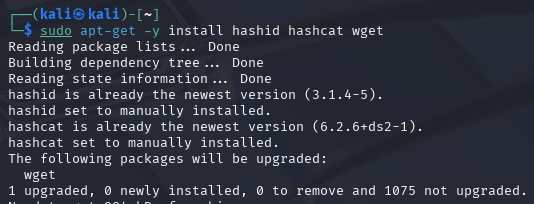

Näistä suurin osa olikin valmiina, wget lähinnä sai päivittelyä samalla. Seuraavaksi oli tarpeellista rakentaa uusi kansio ja ja ladata sekä purkaa sinne iso kirjasto tehtävää varten. Latasin Teron ohjeissakin olevan suositun [Rockyou](https://github.com/danielmiessler/SecLists/raw/master/Passwords/Leaked-Databases/rockyou.txt.tar.gz) kirjaston.

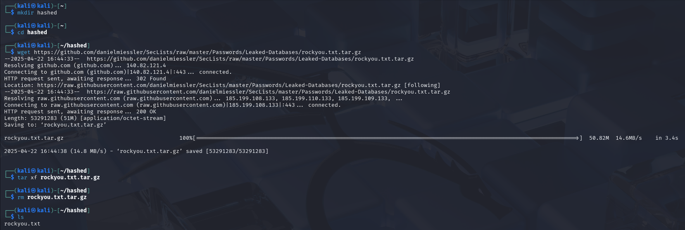

Tarkistellaan vielä, mitä rockyou pitää sisällään.

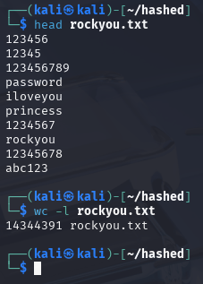

Hashcat tarvitsee tiedoksensa hash tyypin, mitä se meinaa murtaa, joten annetaan se sille.

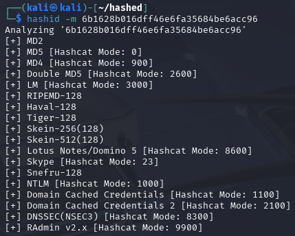

Seuraavaksi murretaan hashcatilla kyseinen hash, hyödyntäen tietenkin rockyou.txt krijastoa.

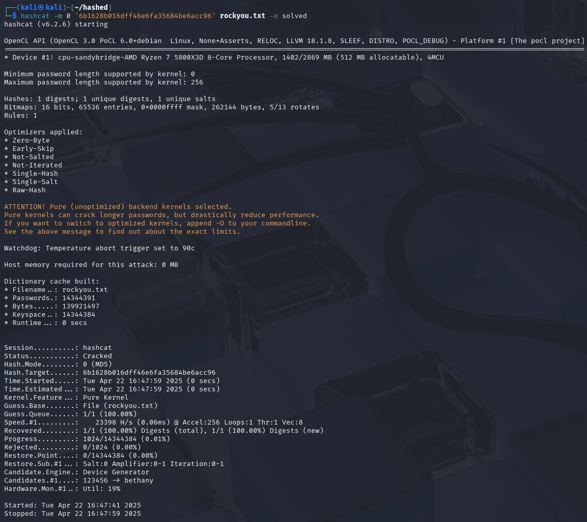

Ja tuloksia voidaankin lukea suoraan tarkastelemalla catilla. 

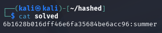

Salasanahan oli "summer".

(Karvinen 2022)
## c) Asenna John the Ripper ja testaa sen toiminta murtamalla jonkin esimerkkitiedoston salasana.
Tehtävää varten oli asenneltava tarpeelliset työkalut. Teron [ohjeessa](https://terokarvinen.com/2023/crack-file-password-with-john/) oli Debian 11 työkalut, mutta eipä ne hirveästi poikennut Kalin nykyisistä tarpeista.

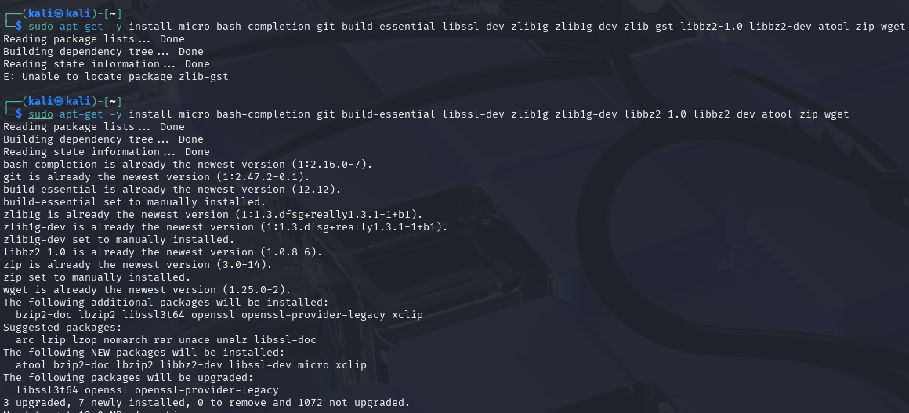

Latasin John the Ripperin suoraan kloonaamalla GitHubista.

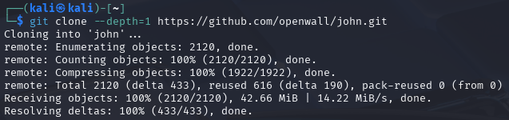

`./configure` tunnistaa ajetun ympäristön ja tekee seuraavaa kohtaa varten makefilen.

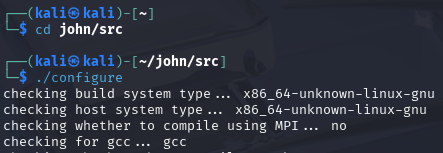
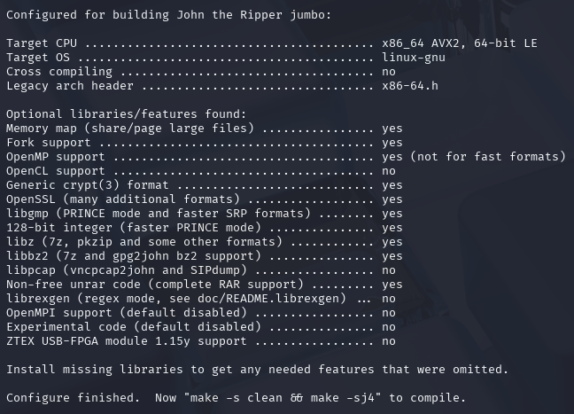

Tämän luotua voidaan koota John pystyyn.

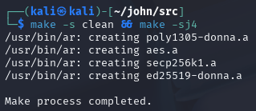

Ja testataan tietenkin, toimiiko John!

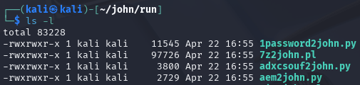
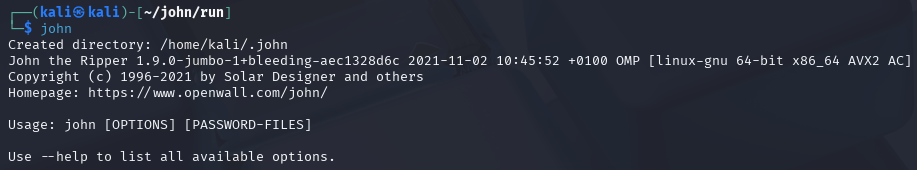

Itse tehtävän ratkaisua varten Tero [tarjosi](https://TeroKarvinen.com/2023/crack-file-password-with-john/tero.zip) salasanasuojatun ZIP tiedoston mitä lähteä murtamaan.

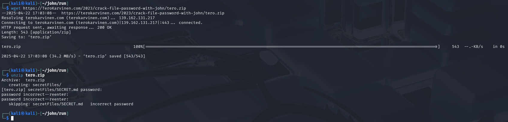

Luodaan Johnin zip2john toimintoa käyttäen tero.zip tiedostosta tero.zip.hash Johnille.

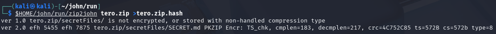

Seuraavaksi annetaan Johnin tehdä työtä käskettyä ja hyökätä hashia kohtaan, löytyisikö sieltä jotain?

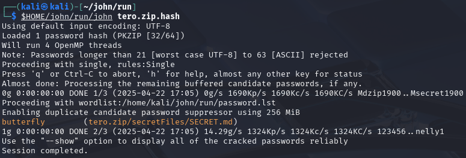

Johnihan tarjoilee meille joukosta salasanan **butterfly**.

(Karvinen 2023)
## e) Tiedosto. Tee itse tai etsi verkosta jokin salakirjoitettu tiedosto, jonka saat auki. Murra sen salaus.
Itse lähdin ratkaisemaan tehtävää tekemällä PDF tiedoston, mikä sisältää salasanan ja sen jälkeen murtamaan se salaus ystäväämme Johnia hyödyntäen. Tehdäänpä siis ensin salattu PDF tiedosto.

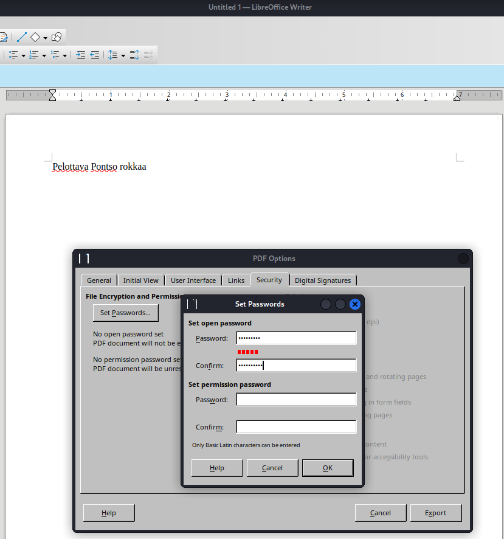
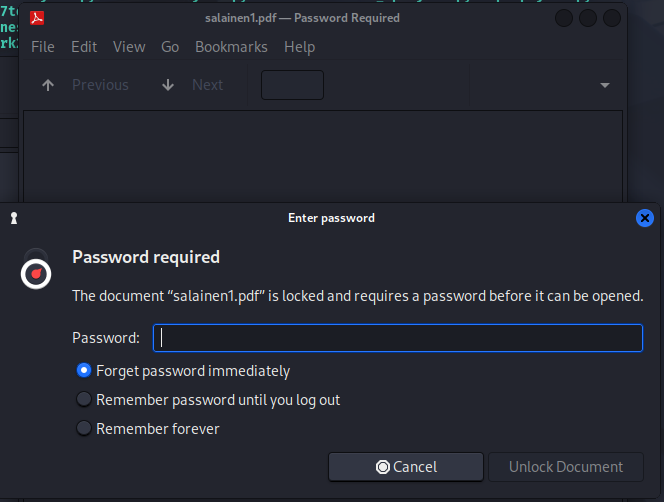

Johnin run kansiota tarkastellessa nähdään, että siellä on pdf2john mitä voidaan hyödyntää hash muuttamiseksi. Muutetaan siis PDF jälleen PDF.hash niin saadaan John hommiin. Tämän jälkeen ajo Johnilla ja katsotaan lopputuloksia:

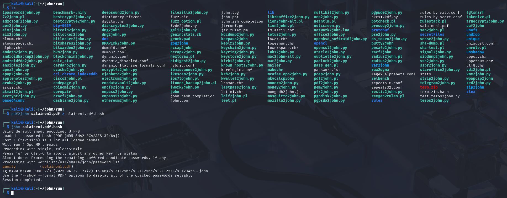

Johnihan mursi salasanan silmänräpäyksessä. Toki annoin todella helpon salasanan murrettavaksi, mutta qwerty löytyi nopeasti.

## f) Tiiviste. Tee itse tai etsi verkosta salasanan tiiviste, jonka saat auki. Murra sen salaus.
Lähdin ratkomaan tehtävää luomalla käyttäjän, antamalla sille salasanan ja sen jälkeen murtamalla sen.

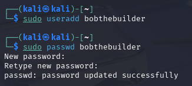

Tämän jälkeen voidaan käyttää suoraan John the Ripperin unshadow toimintoa, joka yhdistää tarpeelliset /etc/passwd ja /etc/shadow yhdeksi paketiksi.

Tämän jälkeen voidaan hyödyntää Johnin crypt ominaisuutta ja murtaa salasanat.

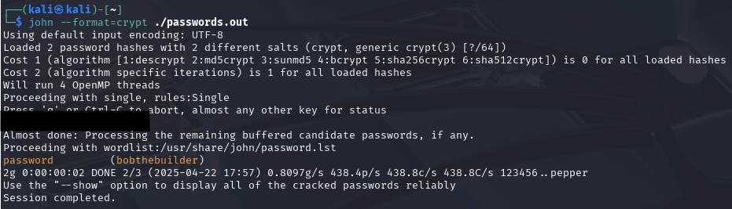

Sieltähän se luodun Bobthebuilderin salasana tuli näkyviin.

(Moyle 2023)
## g) Tee msfvenom-työkalulla haittaohjelma, joka soittaa kotiin (reverse shell). Ota yhteys vastaan metasploitin multi/handler -työkalulla.
Tätä tehtävää varten avasin Metasploitablen ja suljin Kalin yhteyden verkkoon. Metasploitable ja Kali ovat tietenkin Host Only yhteydessä keskenään. Tämä oli itselle hieman tuntemattomampi aihe, joten hyödynsin [101labs erinomaista artikkelia](https://www.101labs.net/comptia-security/lab-75-establishing-a-reverse-shell-on-a-linux-target-using-msfvenom-and-metasploit/) aiheesta.

Alkuun luotiin msfvenomia käyttäen reverse-sh.elf payload. Tähän syötettiin Kalin IP osoite, portti ja tietenkin reverse-sh.elf payload.

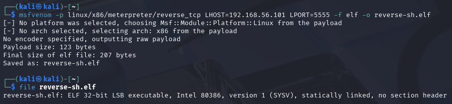

Tämän jälkeen otettiin FTP yhteys Metasploitableen ja siirrettiin kyseinen payload sinne.

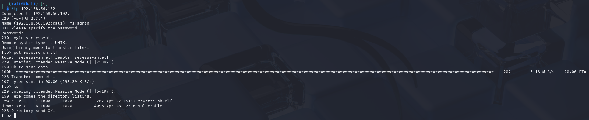

Tämän jälkeen otettiin ssh yhteys Metasploitableen, jotta voidaan tehdä sinne viedystä tiedostosta suoritettava kokonaisuus.

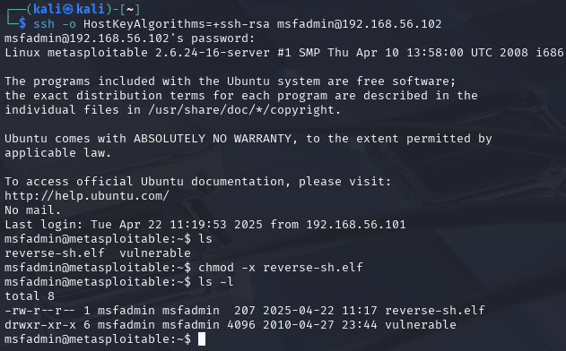

SSH yhteys jätettiin käyntiin ja toiseen konsoliin avattiin itse msfconsole. Tänne syötettiin samat tiedot, mitä alkuperäiseen payloadiin luomisvaiheessa.

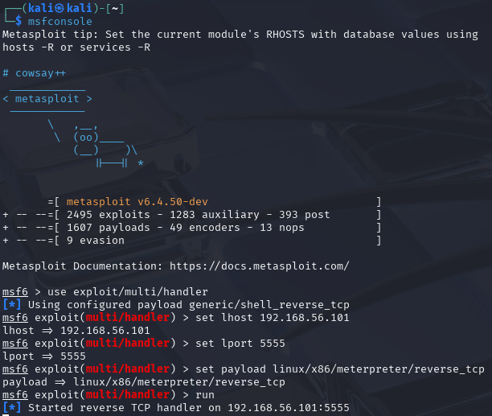

Nyt voidaan Metasploitablen puolelta käynnistellä kyseinen payload.

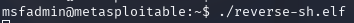

Lopputuloksena saadaan käyntiin ja voidaan käynnistellä shell, mistä päästään suorittamaan komentoja metasploitina.

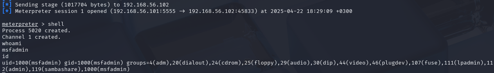

**Tehtävän lopetusaika 22.4.2025 kello 19:20. Aktiivista työskentelyä yhteensä noin 2 tuntia 20 minuuttia.**

## Lähteet
Karvinen T 2025. h4 Leviämässä. Tero Karvisen verkkosivut. Luettavissa: https://terokarvinen.com/tunkeutumistestaus/ Luettu 22.4.2025

Karvinen T 2022. Cracking Passwords with Hashcat. Luettavissa: https://terokarvinen.com/2022/cracking-passwords-with-hashcat/ Luettu 22.4.2025

Karvinen T 2023. Crack File Password With John. Luettavissa: https://terokarvinen.com/2023/crack-file-password-with-john/ Luettu 22.4.2025

Moyle E 2023. How to use the John the Ripper password cracker. Luettavissa: https://www.techtarget.com/searchsecurity/tutorial/How-to-use-the-John-the-Ripper-password-cracker Luettu 22.4.2025

101Labs. Lab 75 – Establishing a reverse shell on a Linux target using Msfvenom and Metasploit. Luettavissa: https://www.101labs.net/comptia-security/lab-75-establishing-a-reverse-shell-on-a-linux-target-using-msfvenom-and-metasploit/ Luettu 22.4.2025
