# h5 Kohti omaa treeniä

## Rauta & HostOS

- Asus X570 ROG Crosshair VIII Dark Hero AM4
- AMD Ryzen 5800X3D
- G.Skill DDR4 2x16gb 3200MHz CL16
- 2x SK hynix Platinum P41 2TB PCIe NVMe Gen4
- Sapphire Radeon RX 7900 XT NITRO+ Vapor-X
- Windows 11 Home 24H2

**Tehtävän aloitusaika 2.5.2025 kello 08:00**

## x) Lue/katso/kuuntele ja tiivistä

### Karvinen 2025: Start Your Research with a Review Article

### Review

## HackTheBox
Tunnarit oli tarpeellista tehdä ja viritellä OpenVPN kautta VPN yhteys pystyyn. HackTheBox ohjeet oli selkeät, latailla sopiva vaihtoehto ja suorittaa se OpenVPN.

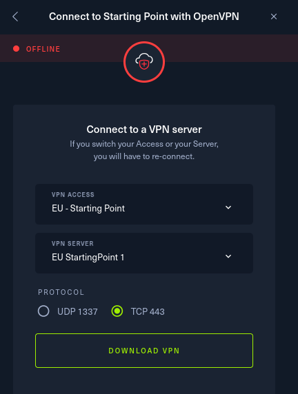

Kuvasta poiketen, käytin UDP valintaa. Lataamisen jälkeen terminaali auki ja suorittaminen tapahtui `sudo openvpn starting_point_Hulluduunari.ovpn`

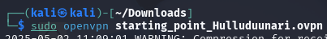

Ja hommahan lähti hyvin toimimaan.

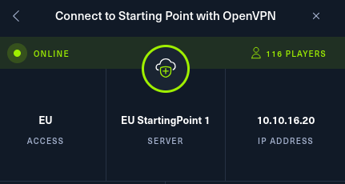

Pingasin vielä testiksi VPN Serveriä, että homma rokkaa.

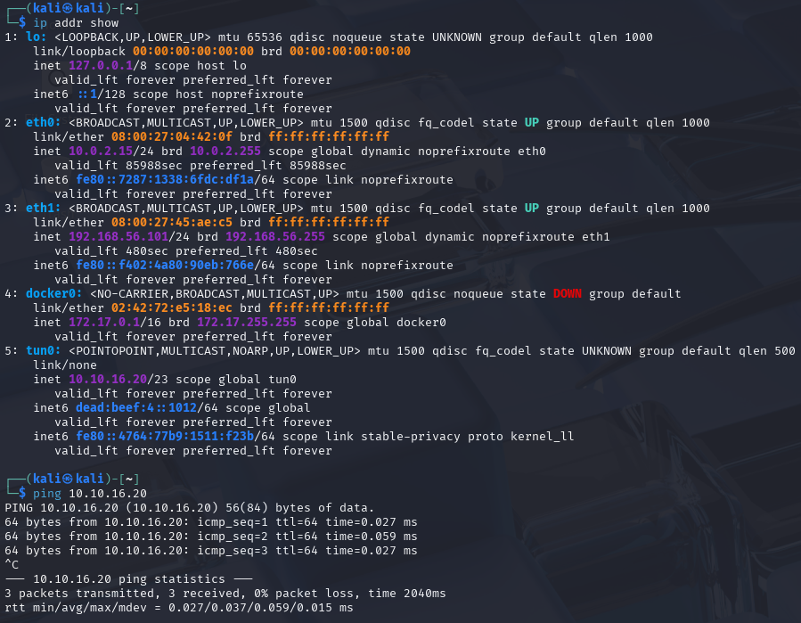

Samaan syssyyn suorittelin myös muutaman tehtävän ennen Dancing, niin sai vähän tuntumaa miten homma toimii. Näistä ei sen tarkempaa raportointia.

(HackTheBox 2025)
## a) HTB Dancing
Tehtävän aloittamista varten pystyyn kohdekone.

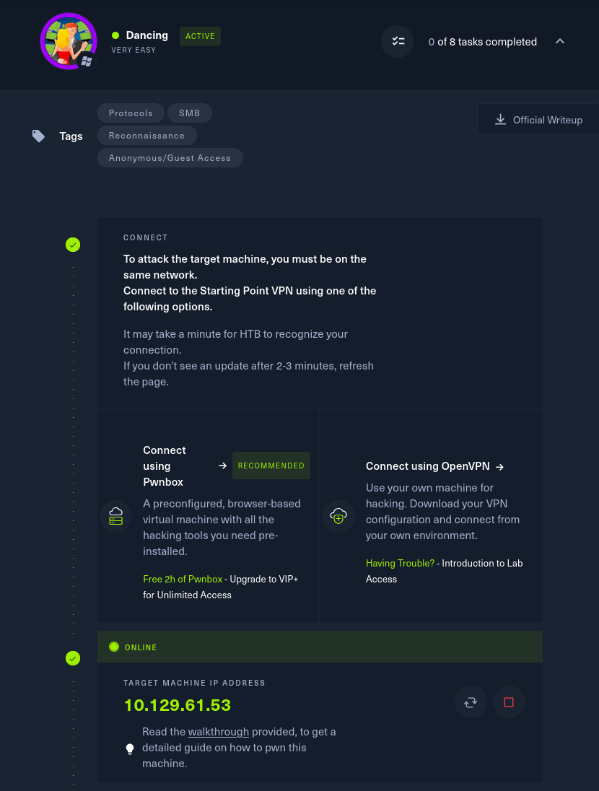

Ja tietenkin testit perään, että kone ylipäätänsä toimii.

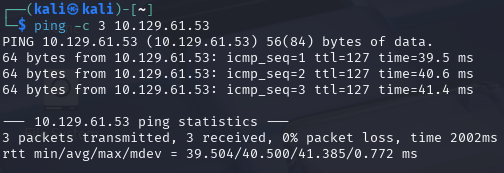

**Task 1: What does the 3-letter acronym SMB stand for?**

Lyhyenne SMB vastaus oli Server Message Block.

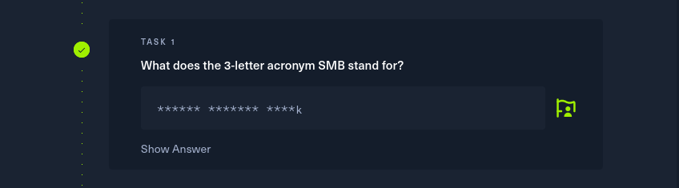

**Task 2: What port does SMB use to operate at?**

SMB operoi tyypillisesti TCP/445.

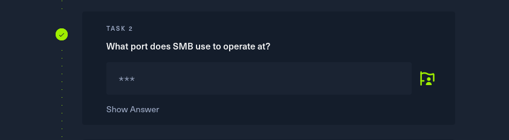

**Task 3: What is the service name for port 445 that came up in our Nmap scan?**

Seuraavassa tehtävässä olikin tarpeellsita selvitellä, millainen service 445 portista löytyy. Ei muuta kuin skannaamaan nmapilla kohdekoneen osoitetta: `sudo nmap 10.129.61.53`

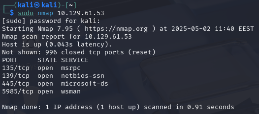

Ja sieltähän me löydetään portista 445 **microsoft-ds**

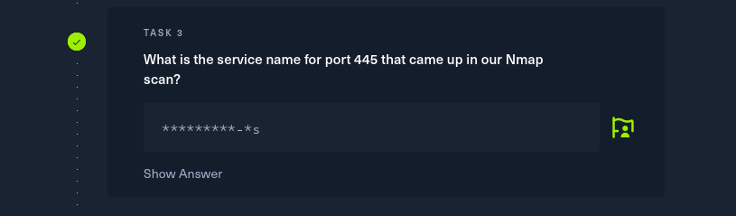

**Task 4: What is the 'flag' or 'switch' that we can use with the smbclient utility to 'list' the available shares on Dancing?**

Ei muuta kuin terminaalista smbclient käyttöohjeet auki, `smbclient -help` ei varsinaisesti ollut oikea vaihtoehto, mutta se listasin silti tarpeelliset tiedot ja nähdäänkin miten **-L** on kyseinen listaus vaihtoehto.

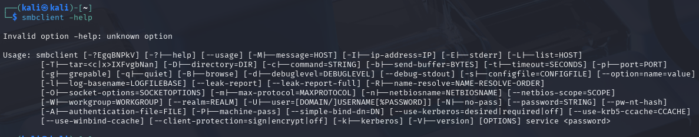
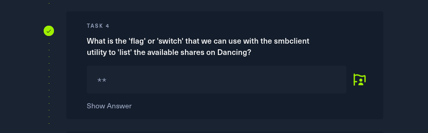

**Task 5: How many shares are there on Dancing?**

Edellisessä tehtävässä opittiinkin se, miten listaus toteutaan niin kokeillaan myös käytännössä `smbclient -L 10.129.61.53`

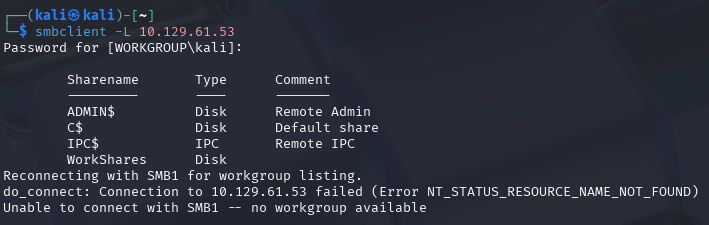

Ja vaikka salasana ei ollut tiedossa, saatiin kuitenkin tietoon se kuinka monta sharesia sielä on, eli **4**

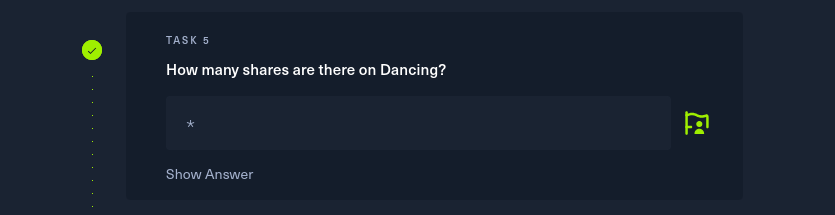

## b) HTB Responder

**Tehtävän lopetusaika 2.5.2025 kello XX:XX. Aktiivista työskentelyä yhteensä noin X tuntia XX minuuttia.**

## Lähteet
Karvinen T 2025. h5 Kohti omaa treeniä. Tero Karvisen verkkosivut. Luettavissa: https://terokarvinen.com/tunkeutumistestaus/ Luettu 2.5.2025

HackTheBox 2025.  Introduction to Starting Point. Luettavissa: https://help.hackthebox.com/en/articles/6007919-introduction-to-starting-point#h_04938711ab Luettu 2.5.2025

https://en.wikipedia.org/wiki/Server_Message_Block

https://medium.com/@ibo1916a/smbclient-command-2803de274e46

https://www.vaadata.com/blog/what-is-rfi-remote-file-inclusion-exploitations-and-security-tips/

https://www.vaadata.com/blog/exploiting-an-lfi-local-file-inclusion-vulnerability-and-security-tips/

https://profiletree.com/how-to-identify-the-programming-language/

https://owasp.org/www-project-web-security-testing-guide/v42/4-Web_Application_Security_Testing/07-Input_Validation_Testing/11.1-Testing_for_Local_File_Inclusion

https://en.wikipedia.org/wiki/NTLM

https://www.kali.org/tools/responder/

https://terokarvinen.com/2022/cracking-passwords-with-hashcat/

https://github.com/nurminenkasper/Tunkeutumistestaus/blob/main/h4/h4-Levi%C3%A4m%C3%A4ss%C3%A4.md

https://www.openwall.com/john/doc/

https://www.kali.org/tools/evil-winrm/

https://www.reddit.com/r/windows/comments/jfvpxq/linux_cat_alternative_for_cmd_on_windows/

