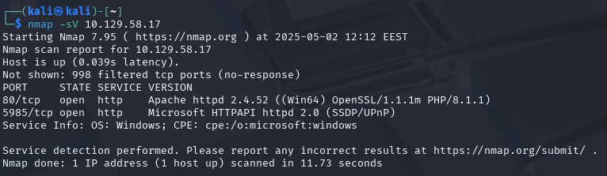
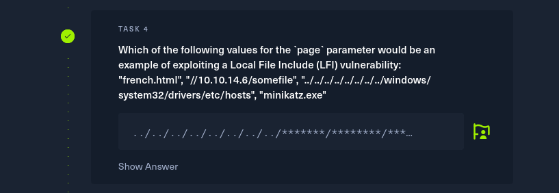

# h5 Kohti omaa treeniä

## Rauta & HostOS

- Asus X570 ROG Crosshair VIII Dark Hero AM4
- AMD Ryzen 5800X3D
- G.Skill DDR4 2x16gb 3200MHz CL16
- 2x SK hynix Platinum P41 2TB PCIe NVMe Gen4
- Sapphire Radeon RX 7900 XT NITRO+ Vapor-X
- Windows 11 Home 24H2

**Tehtävän aloitusaika 2.5.2025 kello 08:00**

## x) Lue/katso/kuuntele ja tiivistä

### Karvinen 2025: Start Your Research with a Review Article

### Review

## HackTheBox
Tunnarit oli tarpeellista tehdä ja viritellä OpenVPN kautta VPN yhteys pystyyn. HackTheBox ohjeet oli selkeät, latailla sopiva vaihtoehto ja suorittaa se OpenVPN.

Kuvasta poiketen, käytin UDP valintaa. Lataamisen jälkeen terminaali auki ja suorittaminen tapahtui `sudo openvpn starting_point_Hulluduunari.ovpn`

Ja hommahan lähti hyvin toimimaan.

Pingasin vielä testiksi VPN Serveriä, että homma rokkaa.

Samaan syssyyn suorittelin myös muutaman tehtävän ennen Dancing, niin sai vähän tuntumaa miten homma toimii. Näistä ei sen tarkempaa raportointia.

(Ryan Gordon 2025)
## a) HTB Dancing
Tehtävän aloittamista varten pystyyn kohdekone.

Ja tietenkin testit perään, että kone ylipäätänsä toimii.

#### Task 1: What does the 3-letter acronym SMB stand for?

Lyhyenne SMB vastaus oli Server Message Block.

#### Task 2: What port does SMB use to operate at?

SMB operoi tyypillisesti TCP/445.

#### Task 3: What is the service name for port 445 that came up in our Nmap scan?

Seuraavassa tehtävässä olikin tarpeellsita selvitellä, millainen service 445 portista löytyy. Ei muuta kuin skannaamaan nmapilla kohdekoneen osoitetta: `sudo nmap 10.129.61.53`

Ja sieltähän me löydetään portista 445 **microsoft-ds**

#### Task 4: What is the 'flag' or 'switch' that we can use with the smbclient utility to 'list' the available shares on Dancing?

Ei muuta kuin terminaalista smbclient käyttöohjeet auki, `smbclient -help` ei varsinaisesti ollut oikea vaihtoehto, mutta se listasin silti tarpeelliset tiedot ja nähdäänkin miten **-L** on kyseinen listaus vaihtoehto.

#### Task 5: How many shares are there on Dancing?

Edellisessä tehtävässä opittiinkin se, miten listaus toteutaan niin kokeillaan myös käytännössä `smbclient -L 10.129.61.53`

Ja vaikka salasana ei ollut tiedossa, saatiin kuitenkin tietoon se kuinka monta sharesia sielä on, eli **4**

#### Task 6: What is the name of the share we are able to access in the end with a blank password? 

Mihin vaihtoehdoista pääsee sisälle pelkällä tyhjällä salasanalla? Smbclient ei ollut kovin tuttu, joten lähdin kokeilemaan miten kirjautua sisään.

Nopeasti selvisi, että \ merkkejä puuttuu, mutta en oikeen saanut help vaihtoehdoista vastausta miten kirjautua sisään niin googlettamalla löytyi [Mediumin artikkeli](https://medium.com/@ibo1916a/smbclient-command-2803de274e46) mistä löytyi oikea tapa kirjautua sisään.

Ja kuten nähdään IPC$ pääsi sisään ilman salasanaa. Käydäänpäs antamassa se vastauksena.

Ei ollutkaan se. Testiksi vielä pääseekö WorkSharesille ja pääseehän sinnekkin ilman salasanaa, joten vastaus oli lopulta **WorkShares**!

#### Task 7: What is the command we can use within the SMB shell to download the files we find? 

Nyt kun meillä oli yhteys auki smb, kokeilin ensin tietenkin help komentoa ja sieltähän löytyi vastaus tehtävään eli **get**

#### Submit root flag

Lähdin tutkimaan tarkemmin, mitä kansiorakenteista löytyy `ls` komennolla

Löytyi kaksi käyttäjää ja tutkin ensin mitä Amy.J alta löytyy.

worknotes.txt voisi olla hyvin lippu, joten ladataan se talteen `get` komennolla.

Tarkistetaan vielä, mitä Jmaes.P alta löytyy.

Ahaa, lippu! Otetaan talteen sekin.

Ja kun tarkastellaan niitä oman koneen puolella, nähdään ettei worknotes sisällä oikeastaan mitään järkevää, mutta puolestaan flag.txt sisältää tehtävän lipun.

Ja näin ollen koko Dancing saatiin suoritettua!

(Ibrahim Atasoy 2023; SMB Wikipedia)
## b) HTB Responder
Homma alkuun käynnistelemällä kohdekone Responder.

#### Task 1: When visiting the web service using the IP address, what is the domain that we are being redirected to? 

Lähdin selvittämään tehtävää ihan puhtaasti suunnistamalla Firefoxilla IP osoitteeseen. Vastaukseksi saatiin **unika.htb**, mutta sivulla ei näkynyt mitään.

#### Task 2: Which scripting language is being used on the server to generate webpages?

En oikein saanut alkuun kiinni, että miten pitäisi selvittää scripting language, jos en saanut koko sivulla mitään näkymään. Aikaisempia tehtäviä myötäillen, ajattelin porttiskannata osoittteen ja katsoa mitä löytyy.

Okei, Apache toki kiinnitti huomion. Ei kuitenkaan ollut minkään sortin käsitystä, miksi sivustolla ei näy mitään. Lähdin tarkastelemaan ensin googlea, mutta lopulta ihan ohjetta miten tehtävä tehdään ja sielähän olikin mainita, että kyseesä on Name-Based Virtual Hosting ja /etc/hosts on asetettava domaini niin hostname toimii oikein.

Nyt kun saatiin sivulle jotain näkyviin, alkuun tarkastelin aika pitkään eri elementtejä ihan Firefoxin omalla Inspector toolilla.

Tässä olinkin jumissa pidemmän tovin ja mitään ei varsinaisesti löytynyt. Klikkailin eri vaihtoehtoja läpi ja oikeastaan puhtaasti sattumalla huomasin kun vaihtaa sivuston kieltä tapahtuu ainoa muutos osoiterivilläkin.

Ja sieltähän tosissaan pilkistää **php** vastaukseksi

#### Task 3: What is the name of the URL parameter which is used to load different language versions of the webpage? 

Tämän vastaus löytyy luonnollisesti samasta URL osoitteesta kuin aikaisempi tehtävä, eli kyseessä on **page**

#### Task 4: Which of the following values for the `page` parameter would be an example of exploiting a Local File Include (LFI) vulnerability: "french.html", "//10.10.14.6/somefile", "../../../../../../../../windows/system32/drivers/etc/hosts", "minikatz.exe" 

Tehtävänannosta herätteli kyllä heti kelloja kyseinen "path traversal" tyyppinen näkymä. Lähdin kuitenkin tutkimaan, mikä tarkalleen on LFI vulnerability ja löysin artikkeliksi [Vaadatan blog postauksen](https://www.vaadata.com/blog/exploiting-an-lfi-local-file-inclusion-vulnerability-and-security-tips/) aiheesta. Eli LFI tavalla hyökkääjä pääsee kirjoittamaan, tässä tapauksessa page= perään omaa haluamaansa tekstiä ohjelmaan. Syötehän mitä haetaan annetaan jo perjaatteessa tehtävänannossa, joten kokeillaan `page=../../../../../../../../windows/system32/drivers/etc/hosts`

Näinhän se toimii ja olotettavasti vastaus tehtäväänkin pitäisi olla sama, mutta ilman page=.

#### Task 5: Which of the following values for the `page` parameter would be an example of exploiting a Remote File Include (RFI) vulnerability: "french.html", "//10.10.14.6/somefile", "../../../../../../../../windows/system32/drivers/etc/hosts", "minikatz.exe"

Alotin tehtävään tutustumisen saman sivun [blog postauksella](https://www.vaadata.com/blog/what-is-rfi-remote-file-inclusion-exploitations-and-security-tips/) kuin edellisessä LFI tehtävässä oli. Kun LFI hyökkäys on mahdollinen, voidaan RFI hyökkäys teoteuttaa. Käytännössä hyökkääjällä on omalla sivulla .php tiedosto mistä hyökkäys lopulta suoritetaan. Kun LFI on todettu toimivaksi, voidaan RFI hyökkäys toteuttaa suoraan hyökkääjän omalta palvelimelta. PHP tiedostossa voi olla vaikka systeemin komentoja mitä suoritetaan tai muuta haitallista. Testasin tätä teoriassa `//10.10.14.6/somefile` mikä oli annettu jo tehtävänannossakin.

Tehtävä oli ehkä oikein? Itselle jäi se kuitenkin hieman epäselväksi, joten tarkastelin asiaa vielä läpijuoksuohjeesta ja sielä olikin sivuttu tarkemmin [include](https://www.php.net/manual/en/function.include.php) liittyviä riskejä. Vastaus tehtävään oli siis lopulta: **//10.10.14.6/somefile**

#### Task 6: What does NTLM stand for? 

NTLM on lyhenne New Technology Lan Manager.

#### Which flag do we use in the Responder utility to specify the network interface? 

**Tehtävän lopetusaika X.2.2025 kello XX:XX. Aktiivista työskentelyä yhteensä noin X tuntia XX minuuttia.**

## Lähteet
Karvinen T 2025. h5 Kohti omaa treeniä. Tero Karvisen verkkosivut. Luettavissa: https://terokarvinen.com/tunkeutumistestaus/ Luettu 2.5.2025

Ryan Gordon 2025. HackTheBox - Introduction to Starting Point. Luettavissa: https://help.hackthebox.com/en/articles/6007919-introduction-to-starting-point#h_04938711ab Luettu 2.5.2025

Wikipedia 2025. Server Message Block. Luettavissa: https://en.wikipedia.org/wiki/Server_Message_Block Luettu 2.5.2025

Ibrahim Atasoy 2023. Smbclient command. Luettavissa: https://medium.com/@ibo1916a/smbclient-command-2803de274e46 Luettu 2.5.2025

TÄMÄN JÄLKEEN KOHTAAN B.

Maha Yassin 2024. How to Identify the Programming Language of a Website. Luettavissa: https://profiletree.com/how-to-identify-the-programming-language/ Luettu 2.5.2025

Arnaud Pascal 2023. Exploiting an LFI (Local File Inclusion) Vulnerability and Security Tips. Luettavissa: https://www.vaadata.com/blog/exploiting-an-lfi-local-file-inclusion-vulnerability-and-security-tips/ Luettu 2.5.2025

Renaud Cayol. What is RFI? Remote File Inclusion Exploitations and Security Tips. Luettavissa: https://www.vaadata.com/blog/what-is-rfi-remote-file-inclusion-exploitations-and-security-tips/ Luettu 2.5.2025

PHP Documents. Luettavissa: https://www.php.net/manual/en/function.include.php Luettu 2.5.2025

NTLM Wikipedia. Luettavissa: https://en.wikipedia.org/wiki/NTLM Luettu 2.5.2025

https://owasp.org/www-project-web-security-testing-guide/v42/4-Web_Application_Security_Testing/07-Input_Validation_Testing/11.1-Testing_for_Local_File_Inclusion

https://www.kali.org/tools/responder/

https://terokarvinen.com/2022/cracking-passwords-with-hashcat/

https://github.com/nurminenkasper/Tunkeutumistestaus/blob/main/h4/h4-Levi%C3%A4m%C3%A4ss%C3%A4.md

https://www.openwall.com/john/doc/

https://www.kali.org/tools/evil-winrm/

https://www.reddit.com/r/windows/comments/jfvpxq/linux_cat_alternative_for_cmd_on_windows/

