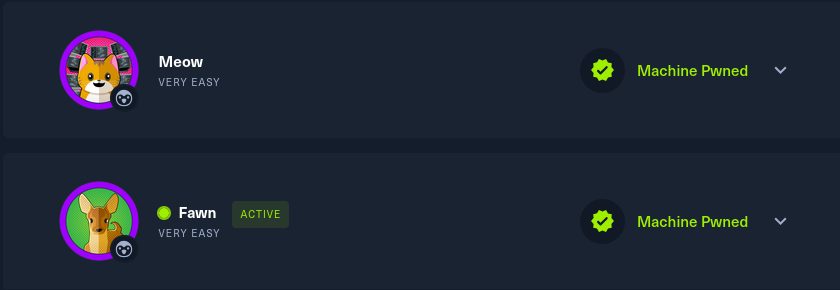

# h5 Kohti omaa treeniä

## Rauta & HostOS

- Asus X570 ROG Crosshair VIII Dark Hero AM4
- AMD Ryzen 5800X3D
- G.Skill DDR4 2x16gb 3200MHz CL16
- 2x SK hynix Platinum P41 2TB PCIe NVMe Gen4
- Sapphire Radeon RX 7900 XT NITRO+ Vapor-X
- Windows 11 Home 24H2

**Tehtävän aloitusaika 2.5.2025 kello 08:00**

## x) Lue/katso/kuuntele ja tiivistä

### Karvinen 2025: Start Your Research with a Review Article

### Review

## HackTheBox
Tunnarit oli tarpeellista tehdä ja viritellä OpenVPN kautta VPN yhteys pystyyn. HackTheBox ohjeet oli selkeät, latailla sopiva vaihtoehto ja suorittaa se OpenVPN.

Kuvasta poiketen, käytin UDP valintaa. Lataamisen jälkeen terminaali auki ja suorittaminen tapahtui `sudo openvpn starting_point_Hulluduunari.ovpn`

Ja hommahan lähti hyvin toimimaan.

Pingasin vielä testiksi VPN Serveriä, että homma rokkaa.

Samaan syssyyn suorittelin myös muutaman tehtävän ennen Dancing, niin sai vähän tuntumaa miten homma toimii. Näistä ei sen tarkempaa raportointia.

(HackTheBox 2025)
## a) HTB Dancing

## b) HTB Responder

**Tehtävän lopetusaika 2.5.2025 kello XX:XX. Aktiivista työskentelyä yhteensä noin X tuntia XX minuuttia.**

## Lähteet
Karvinen T 2025. h5 Kohti omaa treeniä. Tero Karvisen verkkosivut. Luettavissa: https://terokarvinen.com/tunkeutumistestaus/ Luettu 2.5.2025

HackTheBox 2025.  Introduction to Starting Point. Luettavissa: https://help.hackthebox.com/en/articles/6007919-introduction-to-starting-point#h_04938711ab Luettu 2.5.2025

