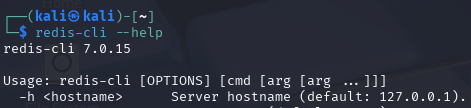

# h6 Maalisuora

## Rauta & HostOS

- Asus X570 ROG Crosshair VIII Dark Hero AM4
- AMD Ryzen 5800X3D
- G.Skill DDR4 2x16gb 3200MHz CL16
- 2x SK hynix Platinum P41 2TB PCIe NVMe Gen4
- Sapphire Radeon RX 7900 XT NITRO+ Vapor-X
- Windows 11 Home 24H2

**Tehtävän aloitusaika 13.5.2025 kello 13:00**

## x) Lue/katso/kuuntele ja tiivistä

### Deviant Ollam - [Why Does My Credit Card Have a Hole in It?](https://www.youtube.com/watch?v=XH_st471JEU)
- Videolla käsitellään sitä, miksi Deviant on tehnyt luottokorttiinsa pienen reijän.
- Pääsääntöisesti kyse on siitä, että reikä poistaa käytöstä sen NFC yli toimivan tap-to-pay, eli suomeksi lähimaksu ominaisuuden.
- Ongelma on lähtenyt siitä, että jos kortti oli puhelimen lähellä niin NFC puhelimesta tunnisti sen kokoajan.

## a) Lippuvalmistelu

- Puhdas Kali Linux VirtualBoxissa.
- Kurssilla käytettyjä työkaluja asennettu
- Ei muuta ylimääräistä tai paikallista tekoälyä asennettuna

## b) Oma Korkki (HackTheBox Redeemer)
Valitsin HackTheBoxista Remeeder koneen mitä lähteä ratkomaa. [Viikon 5](https://github.com/nurminenkasper/Tunkeutumistestaus/blob/main/h5/h5-Kohti-omaa-treeni%C3%A4.md#hackthebox) kotitehtävissä ratkoin jo muutaman ylimääräisenkin ennen varsinaisia tehtäviä, joten tämä on jatkoa niille.

####  Task 1 - Which TCP port is open on the machine?
Tämä saatiin selville skannaamalla nmapilla avoimet portit. 6379 portti näytti olevan avoinna.

#### Task 2 - Which service is running on the port that is open on the machine? 
Ja kun tarkastellaan tarkemmin nmapin skannausta, nähdään serviecn olevan **Redis**

#### Task 3 - What type of database is Redis?
In-memory Database

#### Task 4 - Which command-line utility is used to interact with the Redis server? Enter the program name you would enter into the terminal without any arguments.
Kalissa tarkastelemalla käyttämällä redis+tabulator komentoa, saadaan selville mahdolliset komennot. Tässä tapauksessa **redis-cli** vaikutti järkevimmältä.

#### Task 5 - Which flag is used with the Redis command-line utility to specify the hostname?
Klassikko, eli tarkastellaan --help komennolla käyttötarkoituksia ja selvitellään komento. **-h** näytti olevan oikea vaihtoehto.

#### Task 6 - Once connected to a Redis server, which command is used to obtain the information and statistics about the Redis server?
Käytetään kirjautumistapaa hyödyksi ja tarkastellaan, mikä versio käytössä **info** komennolla.

#### Task 7 - What is the version of the Redis server being used on the target machine?
Tämä saatiin infolla selville. **versio 5.0.7**

#### Task 8 - Which command is used to select the desired database in Redis?
Tätä varten piti perehtyä hieman [redis komentoihin](https://redis.io/docs/latest/commands/), mutta sieltä löytyi **select** komento.

#### Task 9 - How many keys are present inside the database with index 0?
Samalla kaavalla [redis komentosivulta](https://redis.io/docs/latest/commands/keys/) löytyi keys liittyvä komento, mitä hyödyntää. **4** avainta.

#### Task 10 - Which command is used to obtain all the keys in a database?
Kuten ylempänä näkyy, **keys** komennolla saatiin valittua tarvittavat avaimet

#### Task 11 - Submit root flag
**get** komennolla flagia kehiin, toimi kuten cat.

**Tehtävän lopetusaika 13.5.2025 kello XX:00. Aktiivista työskentelyä yhteensä noin XX tuntia XX minuuttia.**

## Lähteet
Karvinen T 2025. h6 Maalisuora. Tero Karvisen verkkosivut. Luettavissa: https://terokarvinen.com/tunkeutumistestaus/ Luettu 13.5.2025

Deviant Ollam Youtube. Why Does My Credit Card Have a Hole in It? Katsottavissa: https://www.youtube.com/watch?v=XH_st471JEU Katsottu 13.5.2025

HackTheBox. Starting Point. Luettavissa: https://app.hackthebox.com/starting-point Luettu 13.5.2025

Reddis.io. Commands. Luettavissa: https://redis.io/docs/latest/commands/ Luettu 13.5.2025
